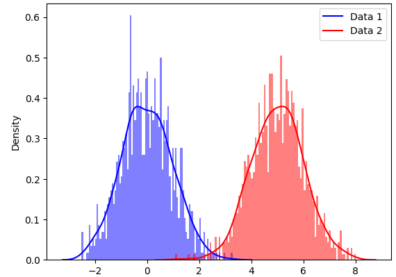
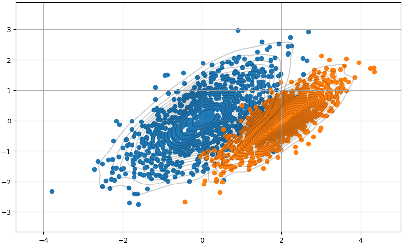
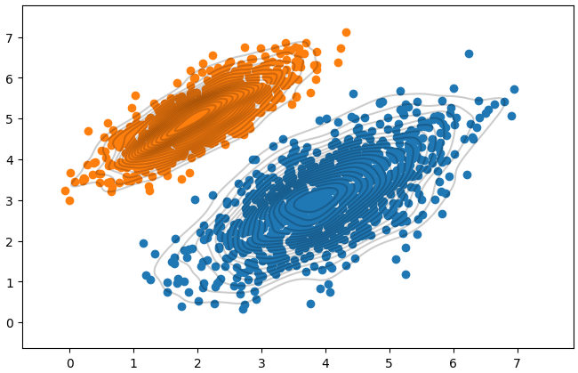

[toc]

# 高斯混合模型

高斯混合模型（`GMM`）的工作原理和 `KMeans` 非常相似，甚至可以认为它是 `KMeans` 的概率版本。 **从概念上解释：高斯混合模型就是用高斯概率密度函数（正态分布曲线）精确地量化事物，它是一个将事物分解为若干的基于高斯概率密度函数（正态分布曲线）形成的模型。**

## 1、GMM的工作原理

正如前面提到的，可以将 `GMM` 称为 概率的`KMeans`，这是因为 `KMeans `和 `GMM `的起点和训练过程是相同的。 但是，`KMeans `使用基于距离的方法，而 `GMM `使用概率方法。 `GMM `中有一个主要假设：数据集由多个高斯分布组成，换句话说，`GMM `模型可以看作是由 `K `个单高斯模型组合而成的模型,这` K `个子模型是混合模型的隐变量`(Hidden variable)`。



上述分布通常称为多模型分布。 每个峰代表我们数据集中不同的高斯分布或聚类。 我们肉眼可以看到这些分布，但是使用公式如何估计这些分布呢？

在解释这个问题之前，我们先创建一些高斯分布。这里我们生成的是多元正态分布； 它是单变量正态分布的更高维扩展。

首先，导入需要的工具包：

```python
import seaborn as sns
import matplotlib.pyplot as plt
import numpy as np
import numpy as np
import matplotlib.pyplot as plt
from mpl_toolkits.mplot3d import Axes3D
from scipy.stats import multivariate_normal
from scipy.stats import norm
import warnings
import random
```

让我们定义数据点的均值和协方差。 使用均值和协方差，我们可以生成如下分布。

```python
# Generate some data with multiple modes
data1 = np.random.normal(0, 1, 1000)
data2 = np.random.normal(5, 1, 1000)

# Plot the data using seaborn's distplot function
sns.distplot(data1, kde=True, hist=True, bins=100, color='b', hist_kws={'alpha': 0.5})
sns.distplot(data2, kde=True, hist=True, bins=100, color='r', hist_kws={'alpha': 0.5})

# Add a legend
plt.legend(['Data 1', 'Data 2'])

# Show the plot
plt.show()
```

可视化一下生成的数据

```python
plt.figure(figsize=(10,6))

plt.scatter(data1[:,0],data1[:,1])
plt.scatter(data2[:,0],data2[:,1])

sns.kdeplot(x=data1[:, 0], y=data1[:, 1], levels=20, linewidth=10, color='k', alpha=0.2)
sns.kdeplot(x=data2[:, 0], y=data2[:, 1], levels=20, linewidth=10, color='k', alpha=0.2)

plt.grid(True)
plt.show()
```



我们上面所做的工作是：使用均值和协方差矩阵生成了随机高斯分布。 而 `GMM `要做正好与这个相反，也就是找到一个分布的**均值**和**协方差**，那么怎么做呢？

工作过程大致如下：

为给定的数据集确定聚类的数量（这里我们可以使用领域知识或其他方法，例如 `BIC/AIC`）。 根据我们上面的参数，有 1000 个数据点，和两个簇2。

初始化每个簇的**均值、协方差**和**权重参数**。

使用==期望最大化算法==执行以下操作：

- 期望步骤（`E-step`）：计算每个数据点属于每个分布的概率，然后使用参数的当前估计评估似然函数
- 最大化步骤（`M-step`）：更新之前的均值、协方差和权重参数，这样最大化E步骤中找到的预期似然
- 重复这些步骤，直到模型收敛。

以上是`GMM `算法的非数学的通俗化的解释。

## 2、GMM数学原理

上面的解释可以看到`GMM `的核心在于上一节中描述的期望最大化 (EM) 算法。在解释之前，我们先演示一下 `EM `算法在 `GMM` 中的应用。

在解释之前，我们先演示一下 `EM `算法在 `GMM `中的应用。

### 2.1 初始化

- `mean (μ)`：随机初始化
- 协方差 ($\sigma$)：随机初始化
- 权重（混合系数）($\pi$)：每个类的分数是指特定数据点属于每个类的可能性。 一开始，这对所有簇都是平等的。 假设我们用三个分量拟合 `GMM`，那么每个组件的权重参数可能设置为 `1/3`，这样概率分布为 `(1/3, 1/3, 1/3)`。

### 2.2 期望步骤(E-step)

对于每个数据点$x_i$，使用以下等式计算数据点属于簇 (`𝑐`) 的概率。 这里的`k`是分布（簇）数。
$$
r_{ic} = \frac{\pi_cN(x_i|μ_c, \sigma_c)}{\sum_{k=1}^{K} \ \pi_k N(x_i|μ_k,\sigma_k)}
$$
上面的$𝜋_𝑐$是高斯分布`c`的混合系数（有时称为权重），它在上一阶段被初始化，$N(x|μ, \sigma)$描述了高斯分布的概率密度函数（`PDF`），均值为`𝜇`和 关于数据点 `x `的协方差 $\sigma$； 所以可以有如下表示。
$$
N(x_i|μ_c, \sigma_c) \ = \ \frac{1}{(2\pi)^\frac{n}{2}|\sigma_c|^\frac{1}{2}} \ exp(-\frac{(x_i-μ_c)^T \ \sigma_c^{-1}(x_i-μ_c)}{2})
$$
`E-step` 使用模型参数的当前估计值计算概率。 这些概率通常称为高斯分布的“`responsibilities`”。 它们由变量$ r_{i,c} $表示，其中` i `是数据点的索引，`c` 是高斯分布的索引。 `responsibilities`衡量第 `c `个高斯分布对生成第 `i `个数据点“负责”的程度。 这里使用条件概率，更具体地说是贝叶斯定理。

一个简单的例子。 假设我们有 `100 `个数据点，需要将它们聚类成两组。 我们可以这样写 $r_{i,c}(i=20,c=1) $。 其中 `i `代表数据点的索引，`c` 代表我们正在考虑的簇的索引。

不要忘记在开始时，$𝜋_𝑐 $会初始化为等值。 在我们的例子中，$𝜋_1 = 𝜋_2 = 1/2$。
$$
r_{20,1} \ = \ \frac{\pi_1 \ N(x_{20}|μ_1, \sigma_1)}{\pi_1 \ N(x_{20}|μ_1, \sigma_1) + \pi_2N(x_20|μ_2,\sigma_2)}
$$
`E-step` 的结果是混合模型中每个数据点和每个高斯分布的一组`responsibilities`。 这些`responsibilities`会在` M-step`更新模型参数的估计。

### 2.3 最大化步骤(M-step)

算法使用高斯分布的`responsibilities`（在 `E-step`中计算的）来更新模型参数的估计值。

`M-step`更新参数的估计如下：
$$
\pi_c = \frac{\sum_{i=1}^m \ r_{i,c}}{m} \\
μ_c = \frac{\sum_{i=1}^m \ r_{i,c} x_i}{\sum_{i=1}^m \ r_{i,c}} \\
\sigma_c = \frac{\sum_{i=1}^m \ r_{i,c}(x_i-μ_c)^2}{\sum_{i=1}^m \ r_{i,c}}
$$
更新后的的估计会在下一个` E-step `中用于计算数据点的新`responsibilities`。

`GMM `将将重复这个过程直到算法收敛，通常在模型参数从一次迭代到下一次迭代没有显着变化时就被认为收敛了。

## 3、Python实现GMM

### 3.1 数据生成

```python
import numpy as np
import matplotlib.pyplot as plt
import seaborn as sns

from sklearn import mixture

mean1 = [4, 3]
mean2 = [2, 5]
cov1 = [[1, .7], [.7, 1]]
cov2 = [[.5, .4], [.4, .5]]

data1 = np.random.multivariate_normal(mean1, cov1, size=1000)
data2 = np.random.multivariate_normal(mean2, cov2, size=1000)

plt.figure(figsize=(8,5))

plt.scatter(data1[:,0],data1[:,1])
plt.scatter(data2[:,0],data2[:,1])

sns.kdeplot(x=data1[:, 0], y=data1[:, 1], levels=20, linewidth=10, color='k', alpha=0.2)
sns.kdeplot(x=data2[:, 0], y=data2[:, 1], levels=20, linewidth=10, color='k', alpha=0.2)

plt.grid(False)
plt.show()
```



### 3.2 训练预测

```python
def GMM(dataMat, components=3, iter=100, cov_type="full"):
    clst = mixture.GaussianMixture(n_components=components, max_iter=iter, covariance_type=cov_type)
    clst.fit(dataMat)
    predicted_labels = clst.predict(dataMat)
    return clst.means_, predicted_labels     # clst.means_返回均值

data_mat = np.concatenate([data1, data2])
means, pred = GMM(data_mat, components=2)

# 输出
means: array([[3.98718668, 3.01706299],
      		  [2.00677432, 5.02003172]])
pred: array([0, 0, 0, ..., 1, 1, 1])
```


