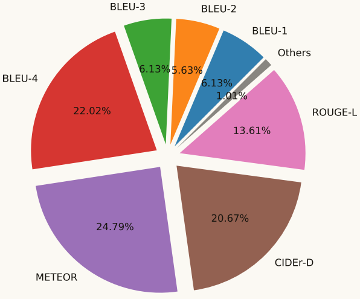

[toc]

# Video captioning A comparative review ofwhere we are and which could be the route

# 摘要

**视频字幕**是描述一系列图像内容的过程，捕捉图像的语义关系和意义。处理单个图像的这个任务是艰巨的，更不用说它是多么困难的视频(或图像序列)。视频字幕应用的数量和相关性是巨大的，主要是处理视频监控中的大量视频记录，或帮助视障人士，举几个例子。为了分析我们的社区在解决视频字幕任务方面的努力是什么，以及什么路径可以更好地遵循，本文对2016年至2022年期间的142篇论文进行了广泛的综述。因此，识别和描述了最常用的数据集和指标。并对所采用的主要方法和最佳方法进行了分析和讨论。此外，我们根据多个性能指标计算一组排名，根据其报告的性能，在多个数据集和指标中获得视频字幕任务的最佳方法和最佳结果。最后，我们总结了一些见解，这些见解是关于下一步可以改进处理这一复杂任务的步骤或机会领域。

# 一、问题定义
视频字幕的主要目标是**让计算机能够理解视频上发生的事情**，**并在视频内容和相应的自然语言描述之间建立牢固的关系**。视频字幕可以被视为自动生成一组描述或解释视频内容的自然语言句子的任务。
和任何机器学习问题一样，视频字幕任务可以被表述为：从数据集$D$中选取一组$(xs,ys)$，其中$xs$为图像集或者序列$xs=xs_1,xs_2,...,xs_n$，$ys$是一个单词序列，$ys=(w_1,w_2,...w_m)$用来描述$xs$的内容，根据相应的图像序列$𝑥𝑠$，找出描述能力最高的概率$ys$，在数据集$D$中所有的$(xs,ys)$对儿。

# 二、架构设计

<center>图1. 视频字幕任务典型解决方案的概述---视频由encoder提取特征，视觉特征采用不同的技术，如CNN、C3D、音频、光流、特征图、目标检测或注意力机制；之后是语言信息，通过LSTM、GRU或Transformer对这些特征进行解码，生成字幕。</center>

典型架构是**encoder-decoder**，如图1所示为示例。**encoder提取视频特征**；然后，**decoder将这些属性转换成文本以生成描述**。采用不同的技术来获取特征。其中最流行的是二维和三维卷积神经网络(CNN)；同时，对时间和空间特征应用了注意机制。

## 2.1 编码器

Encoder通常使用带有二维核的CNN来提取图像特征，但有些架构使用三维(即第三维时间)来检查连续帧来提取运动属性。CNN的输出可以用作解码器的输入，以开始生成标题。这组特征可以通过附加的信息来丰富，比如声音和人体骨骼的检测，这种方法被称为多模态分析。

用于视频字幕的最常用的CNN架构(通常称为主干网)是**VGG、ResNet和Inception**。

1. **VGG**推广了3 × 3核的使用，最大池化层为2 × 2，步幅为2;深度可以根据特定的模型而改变。网络的深度通常用名称来表示，如VGG-16或VGG-19，分别由16层和19层卷积层组成。
2. ResNet是一种以残余连接为特征的神经网络结构，使更深层网络的使用成为可能。
3. **Inception**网络由overhead piled upon的模块组成，使用最大池化层和stride 2来分割分辨率。

## 2.2 目标特征

目标检测技术可以用来识别在帧中发现的类，也可以获得图像中显著区域的特征，并将它们合并到框架的编码器部分。常用的目标检测技术有：**RCNN、YOLO**。

1. 带有CNN的区域(**RCNN**)使用CNN获取2000个选定区域的特征，然后使用线性支持向量机(SVM)对单个区域进行分类。
2. 《You Only Look Once》(**YOLO**)的体系结构提出了一种基于googlet的卷积神经网络，以预测边界盒来检测图像中的物体。该网络由24个卷积层组成，并由两个完全连通的层连接。

## 2.3 时间特征

这部分提取特征有**C3D、I3D、光流**。

1. **C3D**通过应用三维卷积和三维池化过程，可以较好地模拟时间特征;
2. **I3D**是基于一个训练有素的2D结构的CNN，其中的过滤器扩展了额外的时间维度。通常，滤波器的尺寸为𝑁×𝑁，而I3D提出了新的尺寸为𝑁×𝑁×𝑁。
3. **光流技术**根据光照模式的速度来计算物体的运动模式，光照模式在一系列图像中平滑地变化。

## 2.4 其他附加特征

1. Mel Frequency Cepstral Coefficients（**MFCCs**）是一种用于声音和语音处理中特征提取的技术。它们在音频处理、语音识别、音乐信息检索等领域中广泛使用。
2. 提取的骨架特征用于动态建模和估计运动信息；这可以通过对骨架序列进行特殊操作获得特征特征来提高动作识别的性能。

## 2.5 解码器

在第二阶段，解码器通常使用诸如**双向、分层的RNN、LSTM或GRU**等。在这种架构中，字幕每次生成一个单词，这种序列化会导致训练过程缓慢。这些RNN的另一个问题是所谓的渐变消失问题，即来自编码器的特征很容易从第一个生成的单词中获得，但随着标题长度的增加，一些信息可能会丢失。**Transformer**体系结构可以看作是这些问题的答案，最近一些较新的模型已经使用了它。


<center>图2. Transformer的架构</center>

# 三、数据集

<center>表1. 加粗的文本数据集对应于那些最常用的</center>


|                   数据集名称                    |                             链接                             |
| :---------------------------------------------: | :----------------------------------------------------------: |
|            TRECvideo Data（TRECViD）            |                   https://trecvid.nist.gov                   |
|                TACos-MultiLevel                 | www.mpi-inf.mpg.de/departments/computer-vision-and-machine-learning/research/vision-and-language/tacos-multi-level-corpus |
|                  Youtube2text                   |      www.cs.utexas.edu/users/ml/clamp/videoDescription       |
| Large Scale Movie Description Challenge (LSMDC) |       https://sites.google.com/site/describingmovies/        |
|                    Charades                     |              https://allenai.org/data/charades               |
|             ActitivityNet Captions              |    https://cs.stanford.edu/people/ranjaykrishna/densevid/    |
|                    YouCookII                    |               https://youcook2.eecs.umich.edu                |
|                      VATEX                      |           https://eric-xw.github.io/vatex-website            |
|              ActivityNet-Entities               |   https://github.com/facebookresearch/ActivityNet-Entities   |
|              TV show Caption (TVC)              |               https://tvr.cs.unc.edu/tvc.html                |
|         Video Timeline Tags (ViTT-All)          | https://github.com/google-research-datasets/Video-Timeline-Tags-ViTT |
|         LIRIS human activities dataset          |     https://projet.liris.cnrs.fr/voir/activities-dataset     |

## 3.1 常用数据集

使用最多的数据集是**MSVD和MSR-VTT**，这可能是因为视频和字幕的多样性和多样性。


<center>图3. 每个数据集的引用数量</center>

### 3.1.1 MSVD

MSVD (MS-Video youtulips)或YoutubeClips是最早的数据集之一，于2011年提出，并为视频字幕任务生成。该数据集的获取是在亚马逊的土耳其机械(Mechanical Turk)的协助下完成的。它包含1970个片段和70028个句子，每个句子平均8.7个单词;总视频时长为5.3小时，有13010个不同的项。尽管过去可以下载这个数据集，但现在它的链接在微软官方网站上被禁用了。

### 3.1.2 MSR-VTT

MSRVideo to Text (MSR-VTT)。MSR-VTT (Xu et al.， 2016)是视频字幕任务中最广泛的数据集之一。MSR-VTT共提供网络视频10万段，句子20万句;因此，20个不同的句子描述每个片段;每一个的长度都是10到30秒;总时长约为41.2 h。视频内容主要涉及游戏、体育和电影。此数据集的官方页面没有允许其下载的链接。

### 3.1.3 Youtube2text

Youtube2Text是MSVD的一个新兴子集;主要的区别在于英语语言的具体使用。此外，guadarama等人(2013)提出了一种针对训练和测试的相邻视频的独特分割，分别为1300和670。与MSVD数据集相反，导出的英语语料库可以在其网站上找到。

### 3.1.4 YouCookII

YouCookII是一个每个视频片段有两个注释的数据集，第一个描述解释了一个配方，第二个是验证。该数据集包含2000个片段，描述89个菜谱，13,829个句子，总时长176小时;每个视频有3-16个片段。该数据集及其所有信息可在其官方网站上获得。

# 四、性能指标

通常用来评估视频字幕性能的指标是**BLEU、METEOR、ROUGE-L和CIDEr**。这些指标用于**评估模型结果相对于人工注释的性能**。

## 4.1 BLEU

### 4.1.1 定义

1. **BLEU-Bilingual Evaluation Understudy（双语替换评测）**；衡量机器翻译文本与参考文本之间的相似程度的指标,取值范围在0-1, 取值越靠近1表示机器翻译结果越好

2. BLEU算法实际上就是在判断两个句子的相似程度
3. BLEU有许多变种，根据`n-gram`可以划分成多种评价指标，常见的评价指标有BLEU-1、BLEU-2、BLEU-3、BLEU-4四种，其中`n-gram`指的是连续的单词个数为n，BLEU-1衡量的是单词级别的准确性，更高阶的BLEU可以衡量句子的流畅性

$BP$是惩罚因子，其中，$l_c$表示机器翻译译文的长度，$l_s$表示参考译文的有效长度，当存在多个参考译文时，选取和翻译译文最接近的长度。当翻译译文长度大于参考译文长度时，惩罚因子为1，意味着不惩罚，只有翻译译文长度小于参考译文长度时，才会计算惩罚因子。

### 4.1.2 计算步骤

|   candinate   | It is a nice day today  |
| :-----------: | :---------------------: |
| **reference** | **Today is a nice day** |

1. 分别计算`candidate`句和`reference`句的`N-grams`模型，然后统计其匹配的个数，计算匹配度：

$$
\frac{candidate和reference中匹配的n-gram的个数}{candidate在n-gram的个数}
$$

- 使用==1-gram==进行匹配时：

  ```
  candidate: {it, is, a, nice, day, today}
  reference: {today, is, a, nice, day}
  ```

​		其中`{today, is, a, nice, day}`匹配，所以匹配度为5/6

- 使用==2-gram==进行匹配时：

  ```
  candidate: {it is, is a, a nice, nice day, day today}
  reference: {today is, is a, a nice, nice day}
  ```

  其中`{is a, a nice, nice day}`匹配，所以匹配度为3/5

- 使用==3-gram==进行匹配时：

  ```
  candidate: {it is a, is a nice, a nice day, nice day today}
  reference: {today is a, is a nice, a nice day}
  ```

  其中`{is a nice, a nice day}`匹配，所以匹配度为2/4

- 使用==4-gram==进行匹配时：

  ```
  candidate: {it is a nice, is a nice day, a nice day today}
  reference: {today is a nice, is a nice day}
  ```

  其中`{is a nice day}`匹配，所以匹配度为1/3

2. 对匹配的`N-grams`计数进行修改，以确保它考虑到`reference`文本中单词的出现，而非奖励生成大量合理翻译单词的候选结果.

   ```
   举例说明：
   candidate: the the the the
   reference: The cat is standing on the ground
   如果按照1-gram的方法进行匹配，则匹配度为1，显然是不合理的，所以计算某个词的出现次数进行改进
   ```

   将计算某个词的出现次数的方法改为计算**某个词在译文中出现的最小次数**，如下所示，
   $$
   count_k = min(c_k, s_k)
   $$
   其中`k`表示在机器译文（candidate）中出现的第`k`个词语，$c_k$则代表在机器译文中这个词语出现的次数，而$s_k$ 则代表在人工译文（reference）中这个词语出现的次数。
   由此，可以定义BLEU计算公式，首先定义几个数学符号：

   - 人工译文表示为$s_j$，其中$j\in M$，$M$表示有$M$个参考答案
   - 翻译译文表示为$c_i$，其中$i\in E$，$E$表示有$E$个翻译
   - $n$表示$n$个单词长度的词组集合，令$k$表示第$k$个词组
   - $h_k(c_i)$表示第$k$个词组在翻译译文$c_i$中出现的次数
   - $h_k(s_{i,j})$表示第$k$个词组在人工译文$s_{i,j}$中出现的次数

   最后可以得到计算每个`n-gram`的公式，
   $$
   p_n = \frac{\sum_i^E \ \sum_k^E min(h_k(c_i), max_{j \in M} h_k(s_{i,j}))}{\sum_i^E\sum_k^K min(h_k(c_i))}
   $$
   ​		第一个求和符号统计的是所有的翻译句子，因为计算时可能有多个句子；第二个求和符号是统计一条翻译句子中所有的`n-gram`，$max_{j \in M}h_k(s_{i,j})$表示第`i`条翻译句子对应的`M`条人工译文中包含最多第`k`个词组的句子中第`k`个词组的数量

3. `n-gram`匹配度可能会随着句子长度的变短而变好，为了避免这种现象，BLEU在最后的评分结果中引入了长度惩罚因子（Brevity Penalty）
   $$
   BP = \begin{cases}
   1 & if \ \ \ \ \ l_c > l_s \\
   e^{1-\frac{l_s}{l_c}} & if \ \ \ \ \ l_c <= l_s
   \end{cases}
   $$
   其中，$l_c$ 表示机器翻译译文的长度，$l_s$表示参考译文的有效长度，**当存在多个参考译文时，选取和翻译译文最接近的长度**。当翻译译文长度大于参考译文长度时，惩罚因子为1，意味着不惩罚，只有翻译译文长度小于参考译文长度时，才会计算惩罚因子。

4. 计算BLEU最终公式

   为了平衡各阶统计量的作用，对各阶统计量进行加权求和，一般来说，$N$取4，最多只统计==4-gram==的精度，$w_n$取$1/N$，进行均匀加权，最终公式如下：
   $$
   BLEU=BP*exp(\sum_{n=1}^{N} w_n \ log \ p_n)
   $$

### 4.1.3 实例


> 计算累积的BLEU：指的是为各个gram对应的权重加权，来计算得到一个加权几何平均，需要注意BLEU-4并不是只看4-gram的情况，而是计算从1-gram到4-gram的累积分数，加权策略为1-gram、2-gram、3-gram、4-gram的权重各占25%

1. 计算==BLEU-1==：

首先翻译句子的长度为18，而参考译文句子长度分别为16、18、16，选择与翻译句子长度最接近的参考译文句子，此时惩罚因子为1，即不惩罚。

```
math.exp(1 * math.log(0.9444444444444444))
# 0.9444444444444444
```

2. 计算==BLEU-2==：

```
math.exp(0.5 * math.log(0.9444444444444444) + 
		 0.5 * math.log(0.5882352941176471))
# 0.7453559924999299
```

3. 计算==BLEU-3==：

```
math.exp(0.33 * math.log(0.9444444444444444) + 
		 0.33 * math.log(0.5882352941176471) + 
		 0.33 * math.log(0.4375))
# 0.6270220769211224
```

4. 计算==BLEU-4==：

```
math.exp(0.25 * math.log(0.9444444444444444) + 
		 0.25 * math.log(0.5882352941176471) + 
         0.25 * math.log(0.4375) + 
         0.25 * math.log(0.26666666666666666))
# 0.5045666840058485
```

### 4.1.4 实现代码

```python
import sacrebleu
import numpy as np


def combination(ss, level=1):
    re = []
    for s in ss:
        re.append(combination_(s, level=level))
    return re


def combination_(words, level=1):
    re = []
    for i in range(level, len(words)+1):
        re.append(words[i-level:i])
    return re


def unique(eles):
    re = []
    for e in eles:
        if e in re:
            continue
        re.append(e)
    return re


def calP(candidate_clip, sentences_clip):
    cand_set = unique(candidate_clip)
    cl = len(cand_set)
    sl = len(sentences_clip)
    matrix = np.zeros((cl, sl + 2))
    row, col = matrix.shape

    for i, c_clip in enumerate(cand_set):
        for j, s_clip in enumerate(sentences_clip):
            matrix[i][j] = s_clip.count(c_clip)

    matrix[:, -2] = np.max(matrix[:, :sl-1], axis=1)
    matrix[:, -1] = np.min((matrix[:, -2], matrix[:, sl-1]), axis=0)
    return np.around(np.sum(matrix[:, -1]) / np.sum(matrix[:, sl-1]), 3) * 100


def bleu(candidate, sentences, level=4):
    cs = candidate.split(' ')
    ss = [sentence.split(' ') for sentence in sentences]
    ss.append(cs)
    p_s = []

    for i in range(1, level+1):
        p_s.append(calP(combination_(cs, level=i), combination(ss, level=i)))
    return bleu_(p_s)


def bleu_(nums):
    bleus = []
    for i in range(1, len(nums)+1):
        bleus.append(np.exp((1 / i) * np.sum(np.log(nums[:i]))))
    return bleus, nums


sentence1 = "it is a guide to action which ensures that the military always obeys the commands of the party"
sentence2 = "it is a guide to action that ensures that the military will forever heed party commands"
sentence3 = "it is the guiding principle which guarantees the military forces always being under the command of the party"
sentence4 = "it is the practical guide for the army always to heed the directions of the party"

mycleu, nums = bleu(sentence1, [sentence2, sentence3, sentence4])
print('My BLEU: BLEU = %.2lf %.2lf/%.2lf/%.2lf/%.2lf' % (mycleu[3], nums[0], nums[1], nums[2], nums[3]))

# ==>  outout
#
#

bleu = sacrebleu.sentence_bleu(sentence1, [sentence2, sentence3, sentence4])
print("Sentence BLEU: ", bleu)
```

## 4.2 METEOR

### 4.2.1 定义

**METEOR（Metric for Evaluation of Translation with Explicit ORdering）指标考虑了基于整个语料库上的准确率和召回率，而最终得出测度。结合了词汇重叠、词序、同义词等多个因素，以综合评估生成文本的质量。它基于单词级别的准确率和召回率，以及对词序的惩罚，来计算候选文本和参考文本之间的相似度。**

**METEOR**分数考虑了$F_{mean}$和惩罚（$Penalty$）。$F_{mean}$是基于精确率$Precision（P）$和召回率$Recall（R）$的$unigram$匹配，他被认为是一个调和平均值。下列公式说明了这种数学关系：
$$
F_{mean} = \frac{10PR}{R+9P}
$$
具体来说，$𝑃$是$reference$的$unigrams$与模型获得的$unigrams$之比，$𝑅$是$reference$映射的$unigrams$与总$unigrams$之比。

最后考虑的是$Penalty$； 它包括将句子中最小可行量的组块映射为统一组块； 如果块增加，惩罚也会增加。下个公式表示了这种关系。
$$
\text{Penalty} = 0.5 \times (\frac{\boldsymbol{count}(chunks)}{\boldsymbol{count}(unigrams\_matched)})^3
$$
最后，**METEOR**分数被计算为：
$$
\text{METEOR} = F_{mean} \times (1 - \text{Penalty})
$$

### 4.2.2 实现代码

```python
from nltk.translate.meteor_score import meteor_score
from nltk.stem import WordNetLemmatizer
from nltk.corpus import WordNetCorpusReader, wordnet

import numpy as np

'''
1. 如果单词与单词完全相同，那么两个单词就是匹配上了
2. 如果两个单词的词根（即不包含时态和单复数情况）相同，那么两个单词就算匹配上了
3. 如果两个单词是同义词（对于英语来说，同义词有WordNet提供），那么两个单词就算匹配上了
'''


def word_reduction(words):
    '''
        还原词根
    :param words: 单词列表
    :return: 词根列表
    '''
    lemmatizer = WordNetLemmatizer()
    words2 = [lemmatizer.lemmatize(w, pos='v').lower() for w in words]
    return words2


def same(w1, w2):
    synonyms = [w1]
    for synset in wordnet.synsets(w1):
        for lemma in synset.lemmas():
            synonyms.append(lemma.name())
    return w2 in set(synonyms)


def match(hyp, ref):
    hyp = list(enumerate(hyp))
    ref = list(enumerate(ref))

    matched = []
    visited = [False for i in range(len(ref))]

    for i, hw in hyp:
        for j, rw in ref:
            if visited[j]:
                continue
            if same(hw, rw):
                visited[j] = True
                matched.append((i, j))
                break

    return matched


def count_chunks(matches):
    chunk = 1
    i = 1

    while i < len(matches):
        if matches[i - 1][0] + 1 == matches[i][0] and matches[i - 1][1] + 1 == matches[i][1]:
            i += 1
            continue
        i += 1
        chunk += 1
    return chunk


def metero(hyp, refs, alpha=0.9, beta=3.0, gamma=0.5):
    '''
        计算metero score
    :param hyp: 单词列表
    :param refs: 多个单词列表
    :return: metero score
    '''
    hyp = word_reduction(hyp)
    refs = [word_reduction(ref) for ref in refs]
    refs_len = [len(ref) for ref in refs]

    matches = [match(hyp, ref) for ref in refs]
    ms = np.array([len(m) for m in matches])
    Precisions = ms / len(hyp)
    Recalls = ms / refs_len
    chunks = np.array([count_chunks(m) for m in matches])
    frags = chunks / ms
    F_mean = (Precisions * Recalls) / (alpha * Precisions + (1 - alpha) * Recalls)

    scores = (1 - gamma * np.power(frags, beta)) * F_mean

    return np.max(scores)


reference1 = ['the', 'cat', 'sat', 'on', 'the', 'mat']
reference3 = ['the', 'cat', 'sat', 'on', 'the', 'mat']
reference2 = ['on', 'the', 'mat', 'sat', 'the', 'cat']
hypothesis = ['the', 'cat', 'was', 'sat', 'on', 'the', 'mat']

score1 = metero(hypothesis, [reference1, reference2, reference3])

score2 = meteor_score([reference1, reference2, reference3], hypothesis)
# ================================ #
# score1 = 0.9653916211293262 
# score2 = 0.9653916211293262
print(score1, score2)
```

## 4.3 ROUGE

### 4.3.1 定义

**ROUGE（Recall-Oriented Understudy for Gisting Evaluation）**有四个版本：**ROUGE-N, ROUGE-L, rouge，和ROUGE-S**。

### 4.3.2 ROUGE系列

#### 4.3.2.1 ROUGE-N

两个句子，模型生成的为**hypothesis**，标准答案为**reference**

|  hypothesis   | the cat was found under the bed |
| :-----------: | :-----------------------------: |
| **reference** |  **the cat was under the bed**  |

按照**1-gram**和**2-gram**拆分后，可表示为以下表格

|   #   | hyp 1-gram | ref 1-gram |  hyp 2-gram   |  ref 2-gram   |
| :---: | :--------: | :--------: | :-----------: | :-----------: |
|   1   |  ==the==   |  ==the==   |  ==the cat==  |  ==the cat==  |
|   2   |  ==cat==   |  ==cat==   |  ==cat was==  |  ==cat was==  |
|   3   |  ==was==   |  ==was==   |   was found   |   was under   |
|   4   |   found    | ==under==  |  found under  | ==under the== |
|   5   | ==under==  |  ==the==   | ==under the== |  ==the bed==  |
|   6   |  ==the==   |  ==bed==   |  ==the bed==  |               |
|   7   |  ==bed==   |            |               |               |
| count |     7      |     6      |       6       |       5       |

在原论文中，ROUGE-N的公式为：
$$
Rouge-N = \frac{\sum_{S \in ReferenceSummaries} \sum_{gram_n \in S}Count_{match}(gram_n)}{\sum_{S \in ReferenceSummaries}\sum_{gram_n \in S} Count(gram_n)}
$$
分子表示所有样本的标准结果按**N-gram**拆分后与生产结果按**N-gram**拆分后匹配上个数的和；分母表示所有样本的标准结果，按**N-gram**拆分后的和。这样很容易计算，$Rouge-1=\frac{6}{6}=1.0$同样$Rouge-2=\frac{4}{5}=0.8$。以此类推，一般来说**N**越大，分值容易越小。前面提到的都是单个**reference**的情况，对于多个**reference**的情况，论文中也有提到，两两计算取最大值。

#### 4.3.2.2 ROUGE-L

**Rouge-L**的**L**表示: Longest Common Subsequence，**Rouge-L**的计算利用了最长公共子序列（区别一下最长公共子串，这个是连续的，子序列不一定连续，但是二者都是有词的顺序的）。论文中**Rouge-L**的公式可以表示为：
$$
R_{lcs} = \frac{LCS(X, Y)}{m} \\
p_{lcs} = \frac{LCS(X, Y)}{n} \\
F_{lcs} = \frac{(1 + \beta^2)R_{lcs}P_{lcs}}{R_{lcs}+\beta^2P_{lcs}}
$$
上面的公式中，$X$表示标准答案，也就是上面两个句子中的$ref$，$Y$表示生产答案，也就是上面两个句子中的$hyp$。$m$表示$X$的长度，$n$表示$Y$的长度。$LCS(X, Y)$表示$X$和$Y$的最长公共子序列，$\beta$是一个超参数，需要自己设置，论文中提到这个值一般的比较大。沿用上面的例子则可以得到：
$$
m = 6 \\
n = 7 \\
LCS(X, Y) = 6 \\ 
R_{lcs} = \frac{LCS(X, Y)}{m} = \frac{6}{6} = 1.0 \\
p_{lcs} = \frac{LCS(X, Y)}{n} = \frac{6}{7} ≈ 0.86 \\
F_{lcs} = \frac{(1 + \beta^2)R_{lcs}P_{lcs}}{R_{lcs}+\beta^2P_{lcs}} 
= \frac{(1+\beta^2)×1.0×0.86}{1.0+\beta^2×0.86}
$$
公式中的$F_{lcs}$就是$ROUGE-L$的得分，因为$\beta$设置的比较大，所以最终$F_{lcs}$还是受召回率（$R_{lcs}$）的影响更大，也符合**ROUGE**一开始的初衷。

#### 4.3.2.3 ROUGE-W

举个例子，下面三句话，$X$是$reference$，$Y_1、Y_2$是$hypothesis$：

|  $X$  |         A B C D E F G         |
| :---: | :---------------------------: |
| $Y_1$ |       **A B C D** E F G       |
| $Y_2$ | **A** H **B** K **C** I **D** |

我看可以看到三个例子，用**Rouge-L**去计算的时候，他们都有相同的最长公共子序列 ***A***、***B***、***C***、***D***。这个例子中它们有相同的**ROUGE-L**分。但是这种情况下，应该是$Y_1$要好于$Y_2$的，因为$Y_1$有更多的连续匹配。**Rouge-W**就是所做的工作就是给连续的匹配给到更多的权重，==**让连续匹配的比非连续匹配的有更高的分数**==。论文中给出的计算公式是：
$$
R_{wlcs} = f^{-1}(\frac{WLCS(X, Y)}{f(m)}) \\
p_{wlcs} = f^{-1}(\frac{WLCS(X, Y)}{f(n)}) \\
F_{wlcs} = \frac{(1 + \beta^2)R_{wlcs}P_{wlcs}}{R_{wlcs} + \beta^2 P_{wlcs}}
$$
$F_{wlcs}$就是**Rouge-w**分数，上面公式中，$WLCS(X, Y)$是根据连续匹配情况加权后的最长公共子序列长度（叫分值更合适）。在论文中，这两个例子算出来的**Rouge-w**分数是不一样的：$Rouge-W_{Y_{1}}=0.571, Rouge-W_{Y_2}=0.286$。

#### 4.3.2.4 ROUGE-S

**Rouge-S**的S表示：**Skip-Bigram Co-Occurrence Statistics**，这其实是**Rouge-N**的一种扩展，**N-gram**是连续的，**Skip-bigram**是允许跳过中间的某些词，同时结合了**Rouge-L**的计算方式。论文中给到的公式是：
$$
R_{skip2} = \frac{SKIP2(X, Y)}{C(m, 2)} \\
p_{skip2} = \frac{SKIP2(X, Y)}{C(n,2)} \\
F_{skip2} = \frac{(1 + \beta^2)R_{skip2}P_{skip2}}{R_{skip2} + \beta^2 P_{skip2}}
$$
结合几个简单的句子作为例子说明一下：

|   S1（ref）   |   police killed the gunman   |
| :-----------: | :--------------------------: |
| **S2（hyp）** |  **police kill the gunman**  |
| **S3（hyp）** |  **the gunman kill police**  |
| **S4（hyp）** | **the gunman police killed** |
| **S5（hyp）** | **gunman the killed police** |

其中$C(m,2)、C(n,2)$分别表示$reference$、$hypothesis$句子中，**skip-bigram**的组合的个数。

对于**S1，S2**来说$C(S_{1/2},2)$，具体组合为：

|        S1         |        S2         |
| :---------------: | :---------------: |
|   police killed   |    police kill    |
|  **police the**   |  **police the**   |
| **police gunman** | **police gunman** |
|    killed the     |     kill the      |
|   killed gunman   |    kill gunman    |
|  **the gunman**   |  **the gunman**   |

两句话的**skip-bigram**都是6个（$C(4, 2) = 6$），共同的部分$SKIP2(S_1,S_2)=3$。当$\beta=1$时，带入上面公式为：
$$
Rouge-S_{S_1,S_2} = F_{skip2} = \frac{(1 + \beta^2) \times 0.5 \times 0.5}{0.5 + \beta^2 \times 0.5}
$$
有一个比较特别的情况，可以看到**S5**，它与S1出现的单词是一样的，但由于顺序不同，其$SKIP2(S1,S5)=0$，为了区分**S5**这种情况和没有单个单词与**S1**共现的情况，提出了**Rouge-SU**。**Rouge-SU**，**Extension of Rouge-s**，在**Rouge-S**的基础上增加了**unigram**。

**优缺点：缺点是这种方法只能在单词、短语的角度去衡量两个句子的形似度。并不能支持同义词、近义词等语意级别去衡量。比如：**

|   ref    |    I'm very happy!     |
| :------: | :--------------------: |
| **hyp1** |   **I'm very sad!**    |
| **hpy2** | **I'm very cheerful!** |

**hyp1**和**hyp2**的**rouge**得分是**一样的**。但显然hyp1才是与ref更相近的。**好处**是这种方式**计算高效**，在忽略近义词等情况下，做到比较合理的判断。

### 4.3.3 实现代码

**github：**https://github.com/pltrdy/rouge

```python
from rouge import Rouge 

hypothesis = "the #### transcript is a written version of each day 's cnn student news program use this transcript to he    lp students with reading comprehension and vocabulary use the weekly newsquiz to test your knowledge of storie s you     saw on cnn student news"

reference = "this page includes the show transcript use the transcript to help students with reading comprehension and     vocabulary at the bottom of the page , comment for a chance to be mentioned on cnn student news . you must be a teac    her or a student age # # or older to request a mention on the cnn student news roll call . the weekly newsquiz tests     students ' knowledge of even ts in the news"

rouger = Rouge()
scores = rouger.get_scores(hypothesis, reference)
```

## 4.4 CIDEr

### 4.4.1 定义

**CIDEr（Consensus-based Image Description Evaluation）**是专门用于评价图像描述(image caption)任务的评价指标，当然用于其他相关文本生成类任务也是可以的。相较于常用于文本翻译的评价指标BLEU、ROUGE来说，CIDEr更接近人类去判断两个句子是否相近的原理，因为它利用了TF-IDF来对不同n-gram去赋予不同的权重，直观的来说，**即经常出现的词组具有更低的权重，而不常出现的词组则更特殊（具有更大的权重）**，人们会更注意这些特殊的单词。

### 4.4.2 TF-IDF

**TF-IDF**是一种用于信息检索与数据挖掘的常用加权技术，它的全称是词频-逆文档频率（Term Frequency-Inverse Document Frequency）。它的主要作用是**挖掘文章中的关键词**，并**给每个词分配一个权重，反映该词对文章主题的重要程度**。

**TF-IDF**由两部分组成，一部分是**词频（TF）**，==表示一个词在文档中出现的次数或频率，通常会被归一化，以防止偏向长的文件==。另一部分是**逆文档频率（IDF）**，==表示一个词在整个语料库中出现的频率的倒数，通常会取对数，以防止偏向罕见的词==。

### 4.4.3 计算步骤

==**CIDEr是利用TF-IDF来给不同长度的n-gram赋予不同的权重，然后计算候选句子和参考句子的n-gram的余弦相似度，再取平均得到最终的评分**==。**CIDEr**的计算公式如下：
$$
\text{CIDEr}_n(c_i, S_i) = \frac{1}{m} \sum_j \frac{g^n(c_i) \cdot g^n(s_{ij})}{||g^n(c_i)|| ||g^n(s_{ij})||}
$$
其中，$c_i$是候选句子， $S_i$是参考句子集合，$m$是参考句子的数量，$n$是$n-gram$的长度， $g^n(c_i) $和 $g^n(s_{ij})$是候选句子和参考句子的**TF-IDF**向量。**TF-IDF**向量的计算公式如下：
$$
g_k(s_{ij}) = \sum_{w_l \in \Omega} h_k(s_{ij}) log \frac{|I|}{|I_p:w_l \in I_p|}
$$
其中，$\Omega$是所有**n-gram**的集合，$h_k(s_{ij})$是词组$w_l$在参考句子 $s_{ij}$ 中出现的次数，$|I|$是数据集中所有图像的数量， $|I_p:w_l \in I_p|$ 是包含词组 $w_l$ 的图像的数量。

最后，**CIDEr**将所有来自**𝑛**值的**n-gram**结果合并如下：
$$
\text{CIDEr}(c_i, S_i) = \sum_{n=1}^N w_n \text{CIDEr}_n(c_i, S_i)
$$
**CIDEr**还引入了**高斯惩罚**和**长度惩罚**来避免不常见单词重复很多次或者生成过短或过长的句子而得到更高的分数，得到了**CIDEr-D**。

### 4.4.4 n-gram

**n-gram**是一种统计语言模型，它的基本思想是==将文本里面的内容按照字节进行大小为N的滑动窗口操作，形成了长度是N的字节片段序列==。==每一个字节片段称为**gram**==，==对所有gram的出现频度进行统计，并且按照事先设定好的阈值进行过滤，形成关键gram列表==，也就是这个文本的向量特征空间，==列表中的每一种gram就是一个特征向量维度==。

**n-gram**的`N`可以取不同的值，常用的有**一元（unigram），二元（bigram）和三元（trigram）**。==n-gram的N越大，表示词之间的关联性越强，但也越稀疏；n-gram的N越小，表示词之间的关联性越弱，但也越稠密==。

**n-gram**模型可以用于评估语句是否合理，预测下一个词，提取关键词等应用。

# 五、结果与讨论

## 5.1 指标使用频率

首先，按照一个简单的分析方案计算所有性能指标的使用频率。结果，下图显示了每个报告的指标的使用百分比。这里可以看出，使用最多的是==$\text{METEOR}$(24.8%)==，其次是==$\text{BLEU-4}$(22%)和$\text{CIDEr-D}$(20.7%)==，分别排在第二位和第三位。$\text{BLEU-1, BLEU-2和BLEU-3}$的频率也差不多，约为6%，在“其他”标签中，我们加入了这些指标，但报告的结果不到两个；这些是平均-召回率(AR)、SPICE、FCE、RE和Self-BLEU。



<center>图. 在2016年和2022年，142篇论文所采用的评价指标。</center>

## 5.2 指标在各个数据集上的效果


以上表格中排名第一的论文：

|        数据集        |                             论文                             |
| :------------------: | :----------------------------------------------------------: |
|         MSVD         | SwinBERT: End-to-end transformers with sparse attention for video captioning. |
|       MSR-VTT        | Temporal deformable convolutional encoder-decoder networks for video captioning. |
| ActivityNet Captions |  End-to-end dense video captioning with parallel decoding.   |
|        M-VAD         | Multi-task video captioning with video and entailment generation |
|         MPII         |    Video captioning with transferred semantic attributes.    |
|         Y2T          |   Tvt: Two-view transformer network for video captioning.    |
|       Charades       | Graph convolutional network meta-learning with multi-granularity POS guidance for video captioning. |
|      YouCookII       | End-to-end generative pretraining for multimodal video captioning. |

# 六、杰出的方法

## 6.1 最佳方法

一旦确定了文献综述中最好的方法，也必须知道哪些方法或架构是流行的。

第一个分析确定了在==**编码器-解码器**==框架中使用的技术，因为大多数论文使用类似的方法，添加或提出了一种创新，以实现更好的性能。==CNN==出现在大多数作品中；第二常用的网络是==C3D==，在过去的几年里，==RCNN==架构由于其**检测对象**的能力而被越来越多的使用。

我们可以将分析分为什么时候使用特定的编码器和什么时候使用特定的解码器。在下图中，我们显示了用于在视频字幕编码器中提取特征的体系结构的分布。

<center></center>

<center>左、右图为142篇Encoder和Decoder的使用情况</center>

## 6.2 最佳论文

如前所述，我们发现表现最好的作品分别是Seo et al.(2022)、Lin et al.(2022)和Pan et al.(2017)，分别获得第一、第二和第三名。

```
[Seo]: End-to-end generative pretraining for multimodal video captioning
[Lin]: SwinBERT: End-to-end transformers with sparse attention for video captioning.
[Pan]: Video captioning with transferred semantic attributes.
```

### 6.2.1 [Seo]

Seo等人(2022)提出的工作采用视觉和音频信息，并将它们融合为最终的输出。他们训练了一个端到端的编码器-解码器模型，用于字幕生成，取像素值并转录语音。利用两组文本特征和视觉特征，他们使用了一个多模态编码器来融合多模态信息。对于文本编码器，他们采用了BERT-Base架构，并采用了无大小写的词块标记化。然后，他们使用5个不同的数据集进行实验，取得了显著的结果。也许这项工作最相关的方面是使用多模态数据和融合来改进字幕任务。

### 6.2.2 [Lin]

也使用了带有某种注意机制的端到端Transformer架构。在这种情况下，Lin等人(2022)提出了第一个端到端完全基于Transformer的视频字幕模型(称为SwinBERT)，其中稀疏注意掩模作为正则化器，用于改进远程视频序列建模，并定量验证可学习稀疏注意掩模在字幕生成中的有效性。使用了Huggingface Transformer和Kinetics-600的预训练权重。SwinBERT有两个模块：视频Swin Transformer和多模态Transformer编码器。第一种方法从原始视频图像中提取时空视频表示。然后，多模态Transformer编码器以视频表示作为输入，通过序列到序列的方案生成句子。利用注意机制处理冗余数据，特别是视频数据，并提出稀疏约束，以处理较少的数据量，同时选择最相关的数据。

### 6.2.3 [Pan]

Pan等人(2017)提出了一种名为“带有转移语义属性的长短期记忆”(Long - Short-Term Memory with transfer Semantic Attributes, LSTM-TSA)的深层架构，该架构试图从图像和视频中挖掘数据、视频表示和语义属性，主要是为了开发和捕捉两种类型数据之间的语义关系。特别是，他们试图弄清楚如何利用这两个来源的属性来增强视频字幕的结果。因此，给定一段视频，利用2D和3D CNN从视频中提取特定帧的视觉特征，然后通过对这些视觉特征的均值池化来生成视频表示。同样，与之前的工作类似，Pan et al.(2017)使用了一组以上的数据集进行实验，具体来说，他们使用了三个不同的数据集，结果相当出色。

# 七、前进道路和有待改进的方向

## 7.1 标准化数据集

一些经过测试的数据集取得了较低的结果，这可能是在处理这一任务时所提出的方法缺乏泛化的原因。具有已建立的标准的数据集允许对提案的性能进行比较，并且由于数据的多样性而产生的偏差更小。建立句子、词汇、语义、语法和同义关系的数量可以生成更高效的解码器。

## 7.2 特征选取

一些视频内容功能有时会被忽略或不使用，特别是那些与语音识别、运动或一般运动线索有关的功能。

在视频动作识别、视频运动、轨迹分析、目标和分类等方面缺乏前人的优秀研究成果。我们发现，最好的作品会利用与时间或时间线索相关的动作和语义特征[Lin](#[lin])、[Pan](#Pan)。此外，一些杰出的方法处理多模态数据[Seo](#[Seo])，混合它们，并将它们用作补充输入。

## 7.3 改进评价指标

另一个可以改进的基本方面是用于报告性能的评估指标(因此，对模型进行排序)，因为最常用的是那些与语义方面无关的指标;我们意识到一些新的指标，如BLEURT、BERTScore、BERTr和CLIPScore，它们使用语义或上下文嵌入来评估单词的语义关系。

```html
BLEURT: Learning robust metrics for text generation.
Bertscore: Evaluating text generation with bert.
Putting evaluation in context: Contextual embeddings improve machine translation evaluation.
CLIPScore: A reference-free evaluation metric for image captioning.
```

Shi等人(2022)提出了一种专门用于视频字幕的指标——EMScore (embedded matching -based score)，它能够估计视频和生成的字幕之间的相似性，并包含粗粒度(视频和字幕)和细粒度(帧和词)级别的匹配得分。

```html
EMScore: Evaluating video captioning via coarse-grained and fine-grained embedding matching
```

## 7.4 预训练模型研究

如今，预先训练的模型已经变得非常重要，这主要是因为大多数模型是用数百万数据进行训练的，而在大多数情况下，研究人员或利益攸关方不可能生成或使用这些数据(Pan等人，2020b)。然后，微调模型也获得了相关性(Huang et al.， 2020)，利用预先训练的模型，将模型调整到特定的任务或数据。

## 7.5 应用前景

在为数不多的作品中，视频字幕任务主要应用于电影的描述或概要，以帮助视障人士;或者是食谱的描述。此外，智能视频监控等其他领域的研究也很少。该应用程序将有助于安全部门，因为可以为突出事件或异常操作生成自然语言报告。

我们还可以提到为视障人士提供的视频、场景或摄像机镜头的自动字幕，这种实时性能的需求满足了提取有意义的信息，同时丢弃不相关的动作的要求。如果我们向前迈进一步，帮助人们在复杂的环境中导航需要模型的安全性和稳健性，最大化风险检测的真阳性率，最小化用户舒适度的假阳性率。

## 7.6 有希望的途径

- 将视频分成几个部分有助于更好地描述或更深入地描述视频内容。
- 使用多视图视频可以帮助从不同角度或摄像机角度分析整个场景。

# 总结

本文对2016年至2022年进行了比较综述和修订。在本次文献修改中，共分析了142篇以上的文献，并对142篇文献进行了比较。此外，对大多数使用的数据集和指标进行了评估和描述。在此期间，我们比较了基于不同指标的所有作品，即METEOR、BLEU-4和CIDEr-D。我们还比较和考虑了用于训练或评估上述方法的报告数据集。为了获得我们认为的最佳执行方法，我们生成了一个简单的排名方案，其中那些在每个数据集上获得最佳结果的作品获得了较高的分数。实验中使用的数据集越多，他们的分数就越高。基于这个排名程序，我们计算出最佳的三种方法，即Seo等人(2022)、Lin等人(2022)和Pan等人(2017)报告的方法，分别为第一、第二和第三名。最后，在完整的分析之后，我们提出了一些见解和改进的机会，并分析了哪种网络架构在取得最佳效果方面更有优势。


