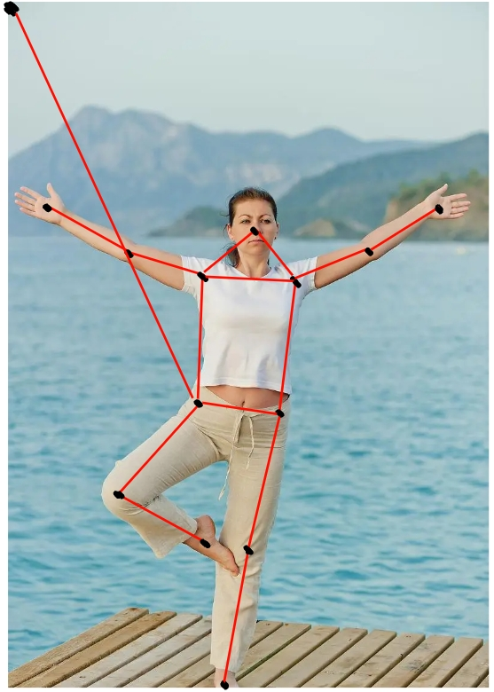
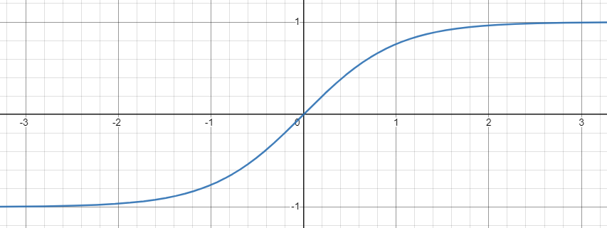
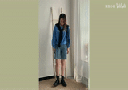
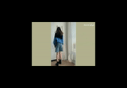
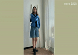
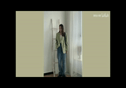
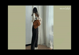

[toc]

# 镜头切换检测进展

## 问题描述

由于前后帧可能出现镜头远近切换的情况，导致切片视频包含人物不连续动作的片段。**根据前后帧检测出人物的关键点距离的差异来判断是否出现镜头切换**。

## 1、实现流程

1. 获取前、后帧中人物关键点的位置坐标$(x_i,y_i)$、关键点置信度$w_i$。

2. 添加坐标原点$(0, 0)$、坐标原点置信度（为1）。

3. 根据坐标值来计算点与点之间的距离$d_{i,j}^t$。

4. 筛选出置信度较高的关键点，以及关键点的位置坐标。

5. 根据点与点的置信度计算连线的权重$w_{i,j}^t$，表示`t`帧图像中点`i`和点`j`连接线的权重。

6. 计算==关键点之间的距离==（用于判断前、后帧人物大小是否相似）、==腰部关键点和坐标原点的距离==（用于判断前、后帧人物位置是否有过大的偏移）。用$d_{i,j}^t$来表示`t`帧图像中点`i`到点`j`的欧式距离。

7. 分别求出前、后帧的距离之和$s(t)，s(t+1)$。

8. 用以下公式来计算前、后帧人物之间的距离差异$diff$：
   $$
   \begin{aligned}
   diff = \tanh(u(t)) &= \frac{e^{2u(t)}-1}{e^{2u(t)}+1}	\\
   u(t) &= \frac{s(t)}{s(t+1)} - 1 							\\
   \text{s}(t) &= \sum_{i}^{n}\sum_{j}^{n}w_{i,j}^td_{i,j}^t, \ \ (i,j) \ \in condition \ set		\\
   w_{i,j}^t &= \sqrt{w_i^t * w_j^t}							\\
   d_{i,j}^t &= \sqrt{(x_i^t-x_j^t)^2+(y_i^t-y_j^t)^2}
   \end{aligned}
   $$

   其中，$w_{i,j}^t$和$d_{i,j}^t$分别表示第`t`帧点`i`和点`j`连接线的权重、距离，`n`表示关键点的数量（共14个关键点，13个人体上的关键点，1个原点），$condition \ set$代表需要算入总距离的连接线集合；如图1所示，$condition \ set$包含图中红色连接点的集合，左上角为原点位置，$d_{i,j}^t$的值为图中所有红线的距离和。

图 1. 人体关键点的位置与距离

   $s(t)、s(t+1)$分别为前、后帧的距离之和，变量$u$则表示$s(t)、s(t+1)$之间的差异，$\tanh$可将差异$u$缩放到区间`(-1, 1)`之间，使用$\tanh$函数可将所有结果缩放到`(-1, 1)`之间，更利于设计合理的阈值进行判断，还可对阈值进行调整，作为判定视频帧变化的标准。较低的阈值代表对画面人物变化的容忍度较低，较高的阈值代表对画面人物变化容忍度较高。`tanh`函数的曲线图像如图2所示：

   
图 2. tanh函数图

9. 描述差异是否过大是通过设计一个阈值`th`来判定，目前设定不符合镜头切换场景的阈值区间为`(-0.1, 0.1)`。

## 2、优化效果

### 2.1 案例1

**未加镜头切换算法对于视频中出现任务位置差异较大的情况无法检测**

|   **未加镜头切换**   |   |
| :-----------: | :---------------------: |
|   **增加镜头切换**   |  |

### 2.2 案例2

**未加镜头切换无法识别景深变化**

|    **未加镜头切换**    ||
|:-----------:|:-----------:|
|    **增加镜头切换**    | |

