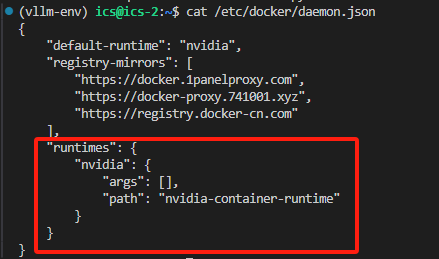
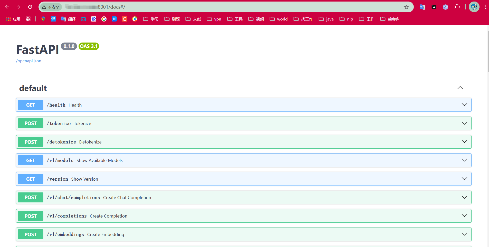
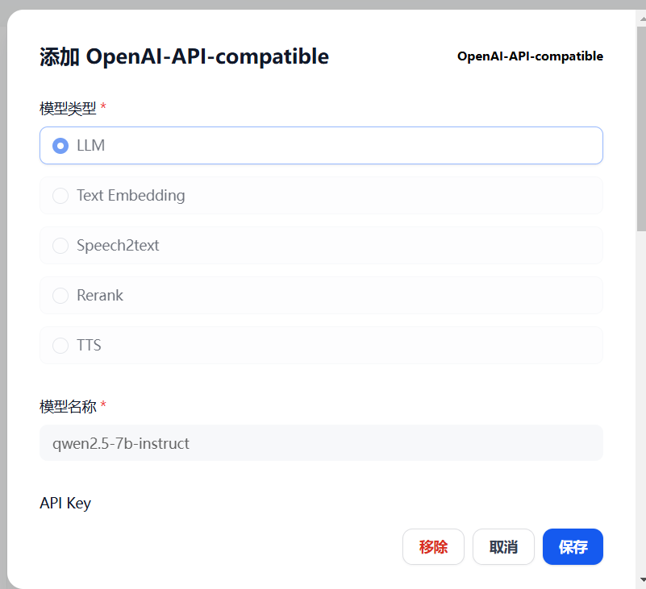
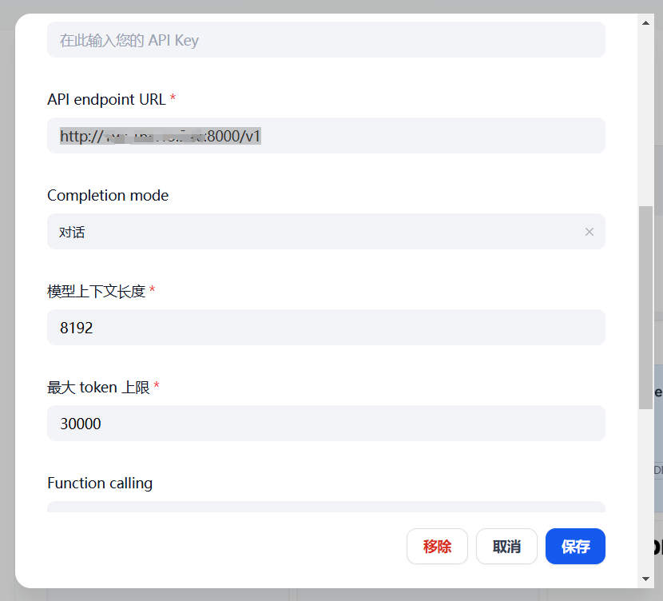
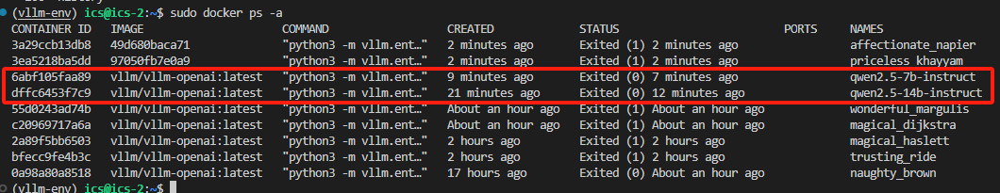
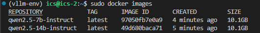

[toc]

# 安装NVIDIA Container Tookit

## 1、下载安装

下面安装方式任选其一即可。

### 1.1 使用apt安装

```bash
curl -fsSL https://nvidia.github.io/libnvidia-container/gpgkey | sudo gpg --dearmor -o /usr/share/keyrings/nvidia-container-toolkit-keyring.gpg \
  && curl -s -L https://nvidia.github.io/libnvidia-container/stable/deb/nvidia-container-toolkit.list | \
    sed 's#deb https://#deb [signed-by=/usr/share/keyrings/nvidia-container-toolkit-keyring.gpg] https://#g' | \
    sudo tee /etc/apt/sources.list.d/nvidia-container-toolkit.list
    
# 从存储库更新软件包列表：
sudo apt-get update

# 安装 NVIDIA Container Toolkit 软件包：
sudo apt-get install -y nvidia-container-toolkit
```

### 1.2 使用yum安装

```bash
curl -s -L https://nvidia.github.io/libnvidia-container/stable/rpm/nvidia-container-toolkit.repo | \
  sudo tee /etc/yum.repos.d/nvidia-container-toolkit.repo
  
# 安装 NVIDIA Container Toolkit 软件包：
sudo yum install -y nvidia-container-toolkit
```

## 2、Docker的配置

### 2.1 使用 nvidia-ctk 命令配置容器运行时

```bash
sudo nvidia-ctk runtime configure --runtime=docker
```

`nvidia-ctk` 命令会修改主机上的 `/etc/docker/daemon.json` 文件。该文件已更新，以便 `Docker` 可以使用 `NVIDIA` 容器运行时。

### 2.2 重新启动 Docker 守护进程

```bash
sudo systemctl restart docker
```

要为以 `Rootless` 模式运行的 `Docker` 配置容器运行时，请按照以下步骤操作： 

使用 `nvidia-ctk` 命令配置容器运行时：

```bash
nvidia-ctk runtime configure --runtime=docker --config=$HOME/.config/docker/daemon.json
```

重新启动 `Rootless Docker` 守护进程

```bash
systemctl --user restart docker
```

使用 `sudo nvidia-ctk` 命令配置 `/etc/nvidia-container-runtime/config.toml`

```bash
sudo nvidia-ctk config --set nvidia-container-cli.no-cgroups --in-place
```

确认下`/etc/docker/daemon.json`文件的内容，**如果没有红色框框的内容就给他加上**：



# Docker部署模型

## 1、启动参数：

```bash
api_server.py [-h] [--host HOST] [--port PORT]
                     [--uvicorn-log-level {debug,info,warning,error,critical,trace}]
                     [--allow-credentials] [--allowed-origins ALLOWED_ORIGINS]
                     [--allowed-methods ALLOWED_METHODS]
                     [--allowed-headers ALLOWED_HEADERS] [--api-key API_KEY]
                     [--lora-modules LORA_MODULES [LORA_MODULES ...]]
                     [--prompt-adapters PROMPT_ADAPTERS [PROMPT_ADAPTERS ...]]
                     [--chat-template CHAT_TEMPLATE]
                     [--chat-template-content-format {auto,string,openai}]
                     [--response-role RESPONSE_ROLE]
                     [--ssl-keyfile SSL_KEYFILE] [--ssl-certfile SSL_CERTFILE]
                     [--ssl-ca-certs SSL_CA_CERTS]
                     [--ssl-cert-reqs SSL_CERT_REQS] [--root-path ROOT_PATH]
                     [--middleware MIDDLEWARE] [--return-tokens-as-token-ids]
                     [--disable-frontend-multiprocessing]
                     [--enable-auto-tool-choice]
                     [--tool-call-parser {granite-20b-fc,granite,hermes,internlm,jamba,llama3_json,mistral,pythonic} or name registered in --tool-parser-plugin]
                     [--tool-parser-plugin TOOL_PARSER_PLUGIN] [--model MODEL]
                     [--task {auto,generate,embedding,embed,classify,score,reward}]
                     [--tokenizer TOKENIZER] [--skip-tokenizer-init]
                     [--revision REVISION] [--code-revision CODE_REVISION]
                     [--tokenizer-revision TOKENIZER_REVISION]
                     [--tokenizer-mode {auto,slow,mistral}]
                     [--trust-remote-code]
                     [--allowed-local-media-path ALLOWED_LOCAL_MEDIA_PATH]
                     [--download-dir DOWNLOAD_DIR]
                     [--load-format {auto,pt,safetensors,npcache,dummy,tensorizer,sharded_state,gguf,bitsandbytes,mistral}]
                     [--config-format {auto,hf,mistral}]
                     [--dtype {auto,half,float16,bfloat16,float,float32}]
                     [--kv-cache-dtype {auto,fp8,fp8_e5m2,fp8_e4m3}]
                     [--quantization-param-path QUANTIZATION_PARAM_PATH]
                     [--max-model-len MAX_MODEL_LEN]
                     [--guided-decoding-backend {outlines,lm-format-enforcer,xgrammar}]
                     [--logits-processor-pattern LOGITS_PROCESSOR_PATTERN]
                     [--distributed-executor-backend {ray,mp}]
                     [--worker-use-ray]
                     [--pipeline-parallel-size PIPELINE_PARALLEL_SIZE]
                     [--tensor-parallel-size TENSOR_PARALLEL_SIZE]
                     [--max-parallel-loading-workers MAX_PARALLEL_LOADING_WORKERS]
                     [--ray-workers-use-nsight] [--block-size {8,16,32}]
                     [--enable-prefix-caching | --no-enable-prefix-caching]
                     [--disable-sliding-window] [--use-v2-block-manager]
                     [--num-lookahead-slots NUM_LOOKAHEAD_SLOTS] [--seed SEED]
                     [--swap-space SWAP_SPACE]
                     [--cpu-offload-gb CPU_OFFLOAD_GB]
                     [--gpu-memory-utilization GPU_MEMORY_UTILIZATION]
                     [--num-gpu-blocks-override NUM_GPU_BLOCKS_OVERRIDE]
                     [--max-num-batched-tokens MAX_NUM_BATCHED_TOKENS]
                     [--max-num-seqs MAX_NUM_SEQS]
                     [--max-logprobs MAX_LOGPROBS] [--disable-log-stats]
                     [--quantization {aqlm,awq,deepspeedfp,tpu_int8,fp8,fbgemm_fp8,modelopt,marlin,gguf,gptq_marlin_24,gptq_marlin,awq_marlin,gptq,compressed-tensors,bitsandbytes,qqq,hqq,experts_int8,neuron_quant,ipex,None}]
                     [--rope-scaling ROPE_SCALING] [--rope-theta ROPE_THETA]
                     [--hf-overrides HF_OVERRIDES] [--enforce-eager]
                     [--max-seq-len-to-capture MAX_SEQ_LEN_TO_CAPTURE]
                     [--disable-custom-all-reduce]
                     [--tokenizer-pool-size TOKENIZER_POOL_SIZE]
                     [--tokenizer-pool-type TOKENIZER_POOL_TYPE]
                     [--tokenizer-pool-extra-config TOKENIZER_POOL_EXTRA_CONFIG]
                     [--limit-mm-per-prompt LIMIT_MM_PER_PROMPT]
                     [--mm-processor-kwargs MM_PROCESSOR_KWARGS]
                     [--mm-cache-preprocessor] [--enable-lora]
                     [--enable-lora-bias] [--max-loras MAX_LORAS]
                     [--max-lora-rank MAX_LORA_RANK]
                     [--lora-extra-vocab-size LORA_EXTRA_VOCAB_SIZE]
                     [--lora-dtype {auto,float16,bfloat16}]
                     [--long-lora-scaling-factors LONG_LORA_SCALING_FACTORS]
                     [--max-cpu-loras MAX_CPU_LORAS] [--fully-sharded-loras]
                     [--enable-prompt-adapter]
                     [--max-prompt-adapters MAX_PROMPT_ADAPTERS]
                     [--max-prompt-adapter-token MAX_PROMPT_ADAPTER_TOKEN]
                     [--device {auto,cuda,neuron,cpu,openvino,tpu,xpu,hpu}]
                     [--num-scheduler-steps NUM_SCHEDULER_STEPS]
                     [--multi-step-stream-outputs [MULTI_STEP_STREAM_OUTPUTS]]
                     [--scheduler-delay-factor SCHEDULER_DELAY_FACTOR]
                     [--enable-chunked-prefill [ENABLE_CHUNKED_PREFILL]]
                     [--speculative-model SPECULATIVE_MODEL]
                     [--speculative-model-quantization {aqlm,awq,deepspeedfp,tpu_int8,fp8,fbgemm_fp8,modelopt,marlin,gguf,gptq_marlin_24,gptq_marlin,awq_marlin,gptq,compressed-tensors,bitsandbytes,qqq,hqq,experts_int8,neuron_quant,ipex,None}]
                     [--num-speculative-tokens NUM_SPECULATIVE_TOKENS]
                     [--speculative-disable-mqa-scorer]
                     [--speculative-draft-tensor-parallel-size SPECULATIVE_DRAFT_TENSOR_PARALLEL_SIZE]
                     [--speculative-max-model-len SPECULATIVE_MAX_MODEL_LEN]
                     [--speculative-disable-by-batch-size SPECULATIVE_DISABLE_BY_BATCH_SIZE]
                     [--ngram-prompt-lookup-max NGRAM_PROMPT_LOOKUP_MAX]
                     [--ngram-prompt-lookup-min NGRAM_PROMPT_LOOKUP_MIN]
                     [--spec-decoding-acceptance-method {rejection_sampler,typical_acceptance_sampler}]
                     [--typical-acceptance-sampler-posterior-threshold TYPICAL_ACCEPTANCE_SAMPLER_POSTERIOR_THRESHOLD]
                     [--typical-acceptance-sampler-posterior-alpha TYPICAL_ACCEPTANCE_SAMPLER_POSTERIOR_ALPHA]
                     [--disable-logprobs-during-spec-decoding [DISABLE_LOGPROBS_DURING_SPEC_DECODING]]
                     [--model-loader-extra-config MODEL_LOADER_EXTRA_CONFIG]
                     [--ignore-patterns IGNORE_PATTERNS]
                     [--preemption-mode PREEMPTION_MODE]
                     [--served-model-name SERVED_MODEL_NAME [SERVED_MODEL_NAME ...]]
                     [--qlora-adapter-name-or-path QLORA_ADAPTER_NAME_OR_PATH]
                     [--otlp-traces-endpoint OTLP_TRACES_ENDPOINT]
                     [--collect-detailed-traces COLLECT_DETAILED_TRACES]
                     [--disable-async-output-proc]
                     [--scheduling-policy {fcfs,priority}]
                     [--override-neuron-config OVERRIDE_NEURON_CONFIG]
                     [--override-pooler-config OVERRIDE_POOLER_CONFIG]
                     [--compilation-config COMPILATION_CONFIG]
                     [--kv-transfer-config KV_TRANSFER_CONFIG]
                     [--worker-cls WORKER_CLS] [--disable-log-requests]
                     [--max-log-len MAX_LOG_LEN] [--disable-fastapi-docs]
                     [--enable-prompt-tokens-details]
```


## 2、部署模型

### 2.1、Docker容器部署Qwen2.5-7B模型

```bash
sudo docker run 
	--name qwen2.5-7b-instruct \
    --runtime nvidia \
    --gpus '"device=2"' \
	-v /home/ics/workspace/llm-models/qwen/Qwen2___5-7B-Instruct:/qwen/Qwen2___5-7B-Instruct \
	-p 8000:8000 \
	--ipc=host \
	vllm/vllm-openai:latest \
	--model /qwen/Qwen2___5-7B-Instruct
	--tensor_parallel_size 1
	--served-model-name qwen2.5-7b-instruct
	
	
# 一行命令
sudo docker run --name qwen2.5-7b-instruct --runtime nvidia --gpus '"device=0"' -v /home/ics/workspace/llm-models/qwen/Qwen2___5-7B-Instruct:/qwen/Qwen2___5-7B-Instruct -p 8000:8000 --ipc=host vllm/vllm-openai:latest --model /qwen/Qwen2___5-7B-Instruct --tensor_parallel_size 1 --served-model-name qwen2.5-7b-instruct

# 后台运行
sudo docker run -d --name qwen2.5-7b-instruct --runtime nvidia --gpus '"device=0"' -v /home/ics/workspace/llm-models/qwen/Qwen2___5-7B-Instruct:/qwen/Qwen2___5-7B-Instruct -p 8000:8000 --ipc=host vllm/vllm-openai:latest --model /qwen/Qwen2___5-7B-Instruct --tensor_parallel_size 1 --served-model-name qwen2.5-7b-instruct
```

### 2.2、Docker容器部署Qwen2.5-14B模型

```bash
sudo docker run \
	--name qwen2.5-14b-instruct
	--runtime nvidia \
	--gpus '"device=0,1"' \
	-v /home/ics/workspace/llm-models/qwen/Qwen2___5-14B-Instruct:/qwen/Qwen2___5-14B-Instruct \
	-p 8001:8000 \
	--ipc=host \ 
	vllm/vllm-openai:latest \
	--model /qwen/Qwen2___5-14B-Instruct
	--tensor_parallel_size 2
	--served-model-name qwen2.5-14b-instruct
	
	
# 一行命令
sudo docker run --name qwen2.5-14b-instruct --runtime nvidia --gpus '"device=1,2"' -v /home/ics/workspace/llm-models/qwen/Qwen2___5-14B-Instruct:/qwen/Qwen2___5-14B-Instruct -p 8001:8000 --ipc=host vllm/vllm-openai:latest --model /qwen/Qwen2___5-14B-Instruct --tensor_parallel_size 2 --served-model-name qwen2.5-14b-instruct

# 后台运行
sudo docker run -d --name qwen2.5-14b-instruct --runtime nvidia --gpus '"device=1,2"' -v /home/ics/workspace/llm-models/qwen/Qwen2___5-14B-Instruct:/qwen/Qwen2___5-14B-Instruct -p 8001:8000 --ipc=host vllm/vllm-openai:latest --model /qwen/Qwen2___5-14B-Instruct --tensor_parallel_size 2 --served-model-name qwen2.5-14b-instruct
```

### 2.3、Docker容器部署Qwen2.5-32B模型

```bash
sudo docker run \
	--name qwen2.5-32b-instruct
	--runtime nvidia \
	--gpus '"device=0,1,2,3"' \
	-v /home/ics/workspace/llm-models/qwen/Qwen2___5-32B-Instruct:/qwen/Qwen2___5-32B-Instruct \
	-p 8003:8000 \
	--ipc=host \ 
	vllm/vllm-openai:latest \
	--model /qwen/Qwen2___5-32B-Instruct
	--tensor_parallel_size 4
	--served-model-name qwen2.5-32b-instruct
	
	
sudo docker run --name qwen2.5-32b-instruct --runtime nvidia --gpus '"device=0,1,2,3"' -v /home/ics/workspace/llm-models/qwen/Qwen2___5-32B-Instruct:/qwen/Qwen2___5-32B-Instruct -p 8003:8000 --ipc=host vllm/vllm-openai:latest --model /qwen/Qwen2___5-32B-Instruct --tensor_parallel_size 4 --served-model-name qwen2.5-32b-instruct

sudo docker run -d --name qwen2.5-32b-instruct --runtime nvidia --gpus '"device=0,1,2,3"' -v /home/ics/workspace/llm-models/qwen/Qwen2___5-32B-Instruct:/qwen/Qwen2___5-32B-Instruct -p 8003:8000 --ipc=host vllm/vllm-openai:latest --model /qwen/Qwen2___5-32B-Instruct --tensor_parallel_size 4 --served-model-name qwen2.5-32b-instruct
```

### 2.4、Docker容器部署Embedding model

#### **bge-large-zh-v1.5**

```bash
sudo docker run \
	--name bge-large-zh-v1.5 \
	--runtime nvidia \
	--gpus '"device=0"' \
	-v /home/ics/workspace/llm-models/AI-ModelScope/bge-large-zh-v1___5:/AI-ModelScope/bge-large-zh-v1___5 \
	-p 8002:8000 \
	--ipc=host \ 
	vllm/vllm-openai:latest \
	--model /AI-ModelScope/bge-large-zh-v1___5 \
	--tensor_parallel_size 1 \
	--served-model-name bge-large-zh-v1.5
	
	
sudo docker run -d --name bge-large-zh-v1.5 --runtime nvidia --gpus '"device=0"' -v /home/ics/workspace/llm-models/AI-ModelScope/bge-large-zh-v1___5:/AI-ModelScope/bge-large-zh-v1___5 -p 8002:8000 --ipc=host vllm/vllm-openai:latest --model /AI-ModelScope/bge-large-zh-v1___5 --tensor_parallel_size 1 --served-model-name bge-large-zh-v1.5
```

#### **bge-m3**

```bash
sudo docker run \
	--name bge-m3 \
	--runtime nvidia \
	--gpus '"device=0"' \
	-v /home/ics/workspace/llm-models/Xorbits/bge-m3:/Xorbits/bge-m3 \
	-p 8003:8000 \
	--ipc=host \ 
	vllm/vllm-openai:latest \
	--model /Xorbits/bge-m3 \
	--tensor_parallel_size 1 \
	--served-model-name bge-m3
	
	
sudo docker run -d --name bge-m3 --runtime nvidia --gpus '"device=0"' -v /home/ics/workspace/llm-models/Xorbits/bge-m3:/Xorbits/bge-m3 -p 8003:8000 --ipc=host vllm/vllm-openai:latest --model /Xorbits/bge-m3 --tensor_parallel_size 1 --served-model-name bge-m3
```

### 2.5、Docker容器部署Rerank model

```bash
sudo docker run \
	--name bge-reranker-large \
	--runtime nvidia \
	--gpus '"device=0"' \
	-v /home/ics/workspace/llm-models/Xorbits/bge-reranker-large:/Xorbits/bge-reranker-large \
	-p 8003:8000 \
	--ipc=host \ 
	vllm/vllm-openai:latest \
	--model /Xorbits/bge-reranker-large \
	--tensor_parallel_size 1 \
	--served-model-name bge-reranker-large

sudo docker run 
	--name bge-rerank-large
	--runtime nvidia
	--gpus '"device=0"' 
	-p 8080:80 
	-v $volume:/data --pull always ghcr.io/huggingface/text-embeddings-inference:1.6 --model-id $model

	
	
sudo docker run -d --name bge-reranker-large --runtime nvidia --gpus '"device=0"' -v /home/ics/workspace/llm-models/Xorbits/bge-reranker-large:/Xorbits/bge-reranker-large -p 8003:8000 --ipc=host vllm/vllm-openai:latest --model /Xorbits/bge-reranker-large --tensor_parallel_size 1 --served-model-name bge-reranker-large
```

## 3、参数详解

- `-d`：后台运行。

- `--name`：容器名称。

- `--runtime`：`nvidia`，记得配置`docker`文件。

  

- `--gpus`：指定模型运行在哪个`gpu`上面，如果仅有一个`gpu`则不需要额外配置`--tensor_parallel_size`参数，如果有多个`gpu`则同时需要配置`--tensor_parallel_size`，后面数字就是你`gpu`的数量。

- `--tensor_parallel_size`：`gpu`的数量。

- `-v`：本地目录与容器目录映射。

- `-p`：本地端口与容器端口映射，容器端口默认为`8000`（别改！），本地端口可随意更改（确保没被占用的情况下）。

- `--ipc`：容器会与宿主机共享 `IPC` 命名空间，这意味着容器中的进程可以访问宿主机的` IPC `资源。

- `vllm/vllm-openai:latest`：使用的是`vllm/vllm-openai:latest`镜像构建。

- `--model`：模型在容器中的路径。

- `--served-model-name`：模型名称。

- `--api-key`：密钥。

## 4、查看文档

当运行成功时，可以访问下面链接查看接口文档介绍。

```bash
# 端口应为你启动容器的本地端口，我的是8001。
http://你的地址:8001/docs#/
```



## 5、测试

```bash
# 7b测试
curl -X POST http://192.168.13.246:8000/v1/completions -H "Content-Type: application/json" -d "{\"model\": \"qwen2.5-7b-instruct\", \"prompt\": \"讲一个笑话\", \"max_tokens\": 100}"

# 14b测试
curl -X POST http://192.168.13.246:8001/v1/completions -H "Content-Type: application/json" -d "{\"model\": \"qwen2.5-14b-instruct\", \"prompt\": \"讲一个笑话\", \"max_tokens\": 100}"
```

# Dify部署

打开`Dify`的`“设置 --> 模型供应商 --> OpenAI-API-compatible”`。

选择**模型类型**、**模型名称**（就是参数`--served-model-name`指定的那个名称）、`API Key`（没有就不填）、`API endpoint URL`（http://你的地址:8000/v1）、`Completion mode`（选择**对话**模式）、其它根据自己需要填写即可。





# 打包为镜像

## 1、查看容器ID

```bash
sudo docker ps -a
```



## 2、打包为镜像

```bash
sudo docker commit 6abf105faa89 qwen2.5-7b-instruct
sudo docker commit dffc6453f7c9 qwen2.5-14b-instruct
```

## 3、查看镜像

```bash
sudo docker images
```



## 4、启动镜像

```bash
# 启动7b模型
sudo docker run -d --name qwen2.5-7b-instruct-new --runtime nvidia --gpus '"device=2"' -v /home/ics/workspace/llm-models/qwen/Qwen2___5-7B-Instruct:/qwen/Qwen2___5-7B-Instruct -p 8000:8000 --ipc=host qwen2.5-7b-instruct --model /qwen/Qwen2___5-7B-Instruct

# 启动14b模型
sudo docker run -d --name qwen2.5-14b-instruct-new --runtime nvidia --gpus '"device=0,1"' -v /home/ics/workspace/llm-models/qwen/Qwen2___5-14B-Instruct:/qwen/Qwen2___5-14B-Instruct -p 8001:8000 --ipc=host qwen2.5-14b-instruct --model /qwen/Qwen2___5-14B-Instruct --tensor_parallel_size 2
```

