[toc]

# nvidia-smi命令找不到

## 1、查询推荐安装的驱动

```bash
sudo ubuntu-drivers devices
```

该命令执行之后，会列出可以安装的驱动，仔细查看每一项是否带`recommend`，找到带`recommend`的一项，

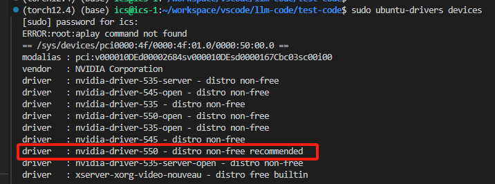

执行安装命令：

```bash
sudo apt install nvidia-driver-{推荐安装的版本号}
# 这里我应该执行
sudo apt install nvidia-driver-550
```

## 2、下载显卡驱动

再官网查找符合自己的驱动[NVIDIA官方驱动](https://www.nvidia.cn/drivers/lookup/):

选择好符合自己配置的选项，点击查找：

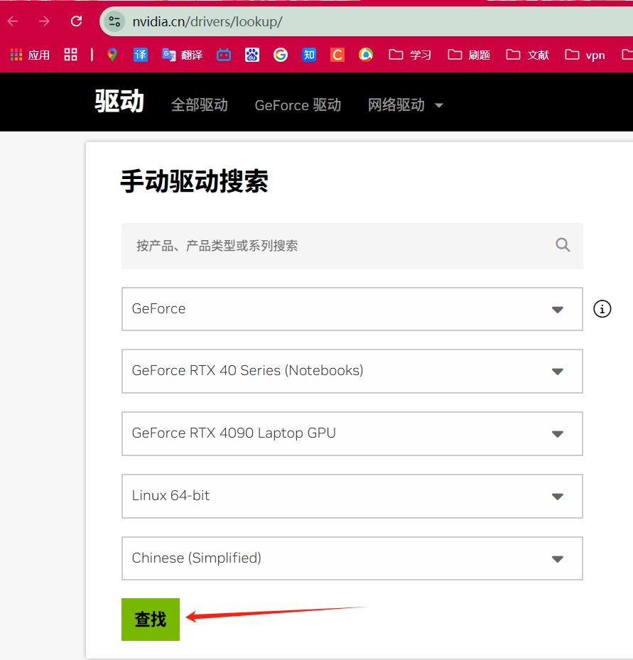

执行命令，我的驱动是`550.120`，之后应下载该版本的驱动文件：

```bash
nvidia-smi
```

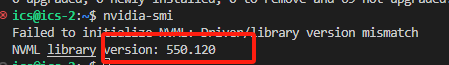

查找后，点击**展开查看更多版本**。

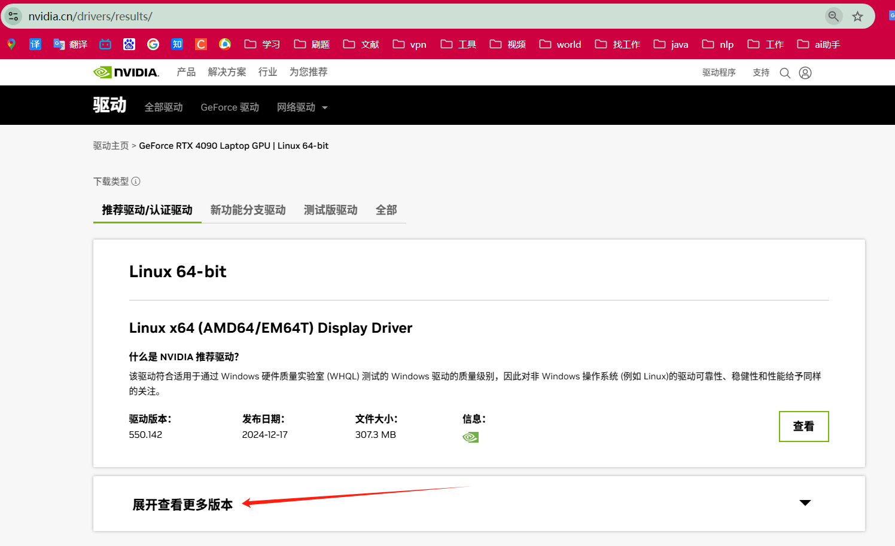

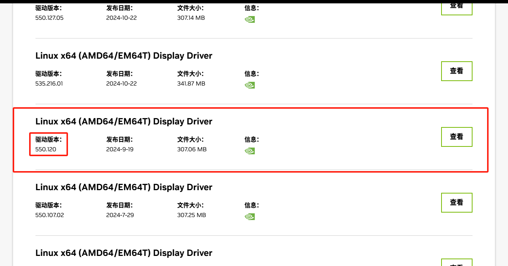

下载完之后，将文件（文件名为：`NVIDIA-Linux-x86_64-550.120.run`）复制到`linux`中。

## 3、禁用nouveau

编辑` /etc/modprobe.d/blacklist-nouveau.conf` 文件，添加以下内容，注意需要管理员权限

```bash
# 指令
sudo vim /etc/modprobe.d/blacklist-nouveau.conf
# 添加的内容
blacklist nouveau
blacklist lbm-nouveau
options nouveau modeset=0
alias nouveau off
alias lbm-nouveau off
# 使用wq!保存并退出
```

输入以下的指令关闭`nouveau`

```bash
echo options nouveau modeset=0 | sudo tee -a /etc/modprobe.d/nouveau-kms.conf
```

最后使用下面的指令重启服务器

```bash
sudo update-initramfs -u
sudo reboot
```

## 4、获取kernel source

```bash
# 安装过的，就不会在安装
sudo apt-get install linux-source
# apt-get install linux-headers-x.x.x-genneric
sudo apt-get install linux-headers-$(uname -r)
```

## 5、安装nvidia驱动

进入到`NVIDIA-Linux-x86_64-550.120.run`文件的目录中，更改文件权限：

```bash
sudo chmod 777 NVIDIA-Linux-x86_64-550.120.run
```

安装：

```bash
sudo ./NVIDIA-Linux-x86_64-550.120.run
```

安装过程中按照默认的选项即可。回车`Continue install`

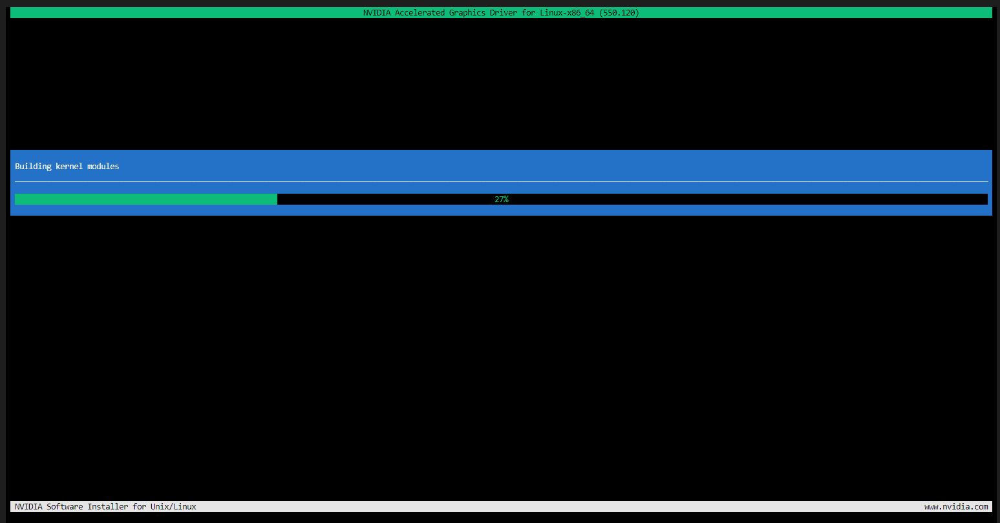

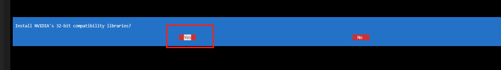

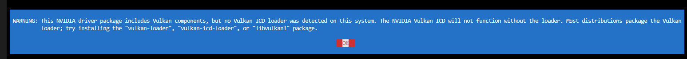


提示已经安装过了，回车`OK`即可。


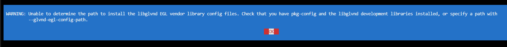

等待安装......

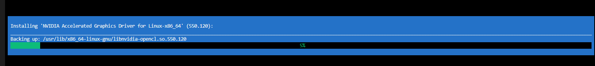

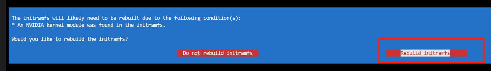

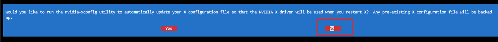

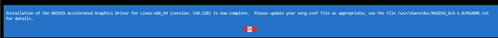

挂载驱动：

```bash
modprobe nvidia
```

安装完成之后使用下面的指令检查一下

```bash
nvidia-smi
```

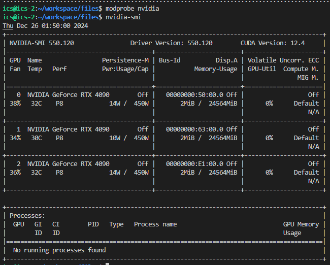

## 6、安装cuda-toolkit

```bash
# 使用这个安装cuda驱动
apt install nvidia-cuda-toolkit
# 检测驱动版本
nvcc -V
```

到这一步会停一下，输入`1`之后回车即可。

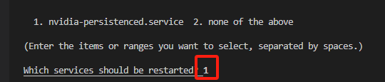

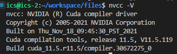

# 安装anaconda

`anaconda`和`miniconda`使用方法一样，不用纠结使用哪一个，这里安装`miniconda`

## 1、下载miniconda

```bash
curl -O https://repo.anaconda.com/miniconda/Miniconda3-latest-Linux-x86_64.sh
```

## 2、安装

找到下载好的`Miniconda`文件，执行以下命令：

```bash
bash ./Miniconda3-latest-Linux-x86_64.sh
```

## 3、测试一下

查看当前环境：

```bash
conda env list
```

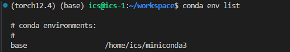

说明已经安装成功！

# ModelScope下载模型脚本

***运行前务必关闭代理！！！更改model_id为想要下载的模型，手动在当前目录中创建models文件夹！***

```python
from modelscope.hub.snapshot_download import snapshot_download
import time
import argparse
from concurrent.futures import ThreadPoolExecutor

def download_snapshot(*, model_id, cache_dir):
    print('Downloading snapshot {}'.format(model_id))
    snapshot_download(f'{model_id}', cache_dir=cache_dir)

def main(model_id, cache_dir):
    with ThreadPoolExecutor(max_workers=4) as executor:
        start = time.time()
        executor.submit(download_snapshot, model_id=model_id, cache_dir=cache_dir)
        end = time.time()
        print('Total elapsed time: {}'.format(end - start))

if __name__ == '__main__':
    parser = argparse.ArgumentParser()
    parser.add_argument('--model_id', type=str, default='Xorbits/bge-m3')
    parser.add_argument('--cache_dir', type=str, default='./models/')
    args = parser.parse_args()
    main(args.model_id, args.cache_dir)
```

# pytorch-gpu环境部署

打开[torch官网](https://pytorch.org/get-started/locally/#linux-pip)，选择对应的配置，注意官网上的`NOTE`提示，最新版的`PyTorch`需要`Python`版本在`3.9`及以上。

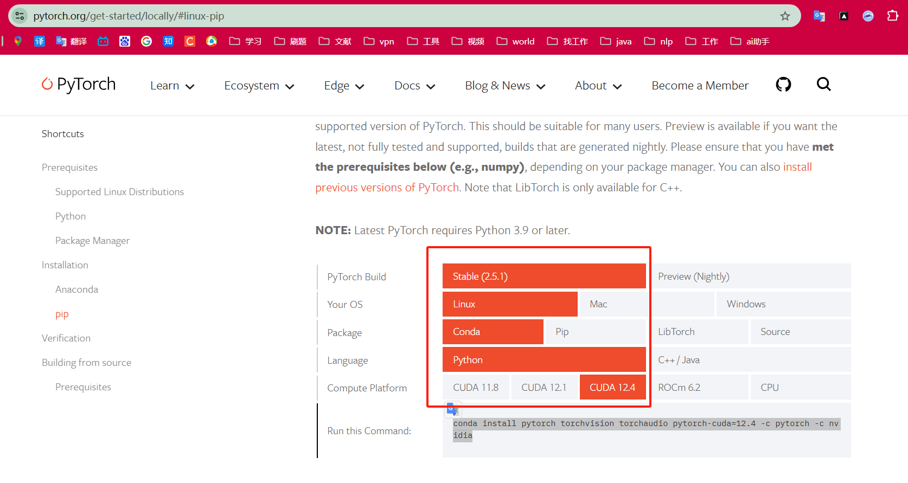

其中`Compute Platform`可以执行`nvidia-smi`来查看：

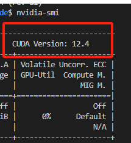

之后执行所给出的命令：

```bash
conda install pytorch torchvision torchaudio pytorch-cuda=12.4 -c pytorch -c nvidia
```

测试：

```python
import torch

print(torch.cuda.is_available()) # true
```

# vLLM部署LLM

## 1、安装vllm

在`anaconda`中选择对应的环境，执行：

```bash
pip install vllm
```

## 2、启动大模型服务

```bash
vllm serve /home/ics/workspace/vscode/llm-models/Qwen/Qwen2___5-32B-Instruct 
    --tensor_parallel_size 4 
    --batch-size 1
    --api-key 123456
    --streaming
```

`tensor_parallel_size`表示你的`GPU`数量，`api-key`表示你在请求`api`时需要指定的密钥。

### 可选启动参数

```bash
vllm serve /home/ics/workspace/vscode/llm-models/Qwen/Qwen2___5-32B-Instruct \
	--tensor_parallel_size 4 \
	--api-key 123456 \
	--pipeline-parallel-size 1 \
    --gpu-memory-utilization 0.98 \
    --cpu-offload-gb 0 \
    --max-model-len 8192 \
    --swap-space 8 \
    --fp16 \
    --port 8080 \
    --log-level INFO \
    --enable-mixed-precision \
    --streaming
    --served-model-name # 模型名字
```

## 3、运行

### 方式1：

`win+R`，输入`cmd`，执行下面命令测试

```bash
curl http://192.168.13.246:8000/v1/chat/completions -H "Content-Type: application/json" -H "Authorization: Bearer 123456" -d "{\"model\":\"/home/ics/workspace/vscode/llm-models/Qwen/Qwen2___5-32B-Instruct\",\"messages\":[{\"role\":\"system\",\"content\":\"你是千问，一个乐于助人的助手.\"},{\"role\":\"user\",\"content\":\"给我讲一个笑话.\"}],\"temperature\":0.7,\"top_p\":0.8,\"repetition_penalty\":1.05,\"max_tokens\":512}"
```

### 方式2：

```python
from openai import OpenAI
# Set OpenAI's API key and API base to use vLLM's API server.
openai_api_key = "123456"
openai_api_base = "http://192.168.13.246:8000/v1"

client = OpenAI(
    api_key=openai_api_key,
    base_url=openai_api_base,
)

chat_response = client.chat.completions.create(
    model="/home/ics/workspace/vscode/llm-models/Qwen/Qwen2___5-32B-Instruct",
    messages=[
        {"role": "system", "content": "你是千问，一个乐于助人的助手."},
        {"role": "user", "content": "告诉我关于大语言模型的一些知识. 用中文回答."},
    ],
    temperature=0.7,
    top_p=0.8,
    max_tokens=512,
    extra_body={
        "repetition_penalty": 1.05,
    },
)
print("Chat response:", chat_response)
```

## 4、Qwen2.5部署

[官方部署文档](https://github.com/QwenLM/Qwen2.5/blob/main/docs/source/deployment/vllm.md)

# Ubuntu22.04安装Docker

下面命令挨个执行即可，有些安装需要手动**回车**继续进行。

## 1、更新

更新Ubuntu软件包列表和已安装软件的版本:

```bash
sudo apt update
sudo apt upgrade
```

## 2、安装依赖

安装Docker在Ubuntu上依赖的软件包：

```bash
sudo apt-get install ca-certificates curl gnupg lsb-release
```

## 3、添加Docker官方GPG密钥

```bash
curl -fsSL http://mirrors.aliyun.com/docker-ce/linux/ubuntu/gpg | sudo apt-key add -
```

## 4、添加docker软件源

```bash
sudo add-apt-repository "deb [arch=amd64] http://mirrors.aliyun.com/docker-ce/linux/ubuntu $(lsb_release -cs) stable"
```

## 5、安装docker

```bash
apt-get install docker-ce docker-ce-cli containerd.io
```

## 6、配置用户组（可选）

默认情况下，只有`root`用户和`docker`组的用户才能运行`Docker`命令。我们可以将当前用户添加到`docker`组，以避免每次使用`Docker`时都需要使用`sudo`。命令如下：

```bash
sudo usermod -aG docker $USER
```

## 7、运行docker

我们可以通过启动`docker`来验证我们是否成功安装。命令如下：

```bash
systemctl start docker
```

**安装工具**

```bash
sudo apt-get -y install apt-transport-https ca-certificates curl software-properties-common
```

查看`docker`版本

```bash
sudo docker version
```

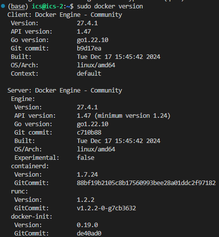

## 8、配置下载镜像源

`docker`默认使用国外镜像源，平时拉取镜像速度会很慢甚至超时，因此添加下面镜像下载链接可以加速我们拉取镜像的速度。

在`Ubuntu`系统中更改**/etc/docker/daemon.json**文件，将以下内容复制上去就可以了，如果没有该文件和目录，自行创建！！！

```bash
sudo vim /etc/docker/daemon.json
```

添加下面内容

```bash
{
  "registry-mirrors": [
  		"https://docker.registry.cyou",
		"https://docker-cf.registry.cyou",
		"https://dockercf.jsdelivr.fyi",
		"https://docker.jsdelivr.fyi",
		"https://dockertest.jsdelivr.fyi",
		"https://mirror.aliyuncs.com",
		"https://dockerproxy.com",
		"https://mirror.baidubce.com",
		"https://docker.m.daocloud.io",
		"https://docker.nju.edu.cn",
		"https://docker.mirrors.sjtug.sjtu.edu.cn",
		"https://docker.mirrors.ustc.edu.cn",
		"https://mirror.iscas.ac.cn",
		"https://docker.rainbond.cc"
	]
}
```
更改完之后，重启`docker`
```bash
sudo systemctl daemon-reload
sudo systemctl restart docker
```