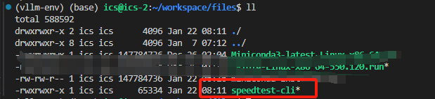
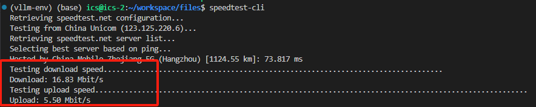

[toc]


# 网速测试

使用`pip`安装`speedtest-cli`。

```bash
pip install speedtest-cli
```

下载官方给的测试文件：

```bash
wget -O speedtest-cli https://raw.githubusercontent.com/sivel/speedtest-cli/master/speedtest.py
chmod +x speedtest-cli
```

之后会发现当前目录已经下载好了`speedtest-cli`。



执行下面命令即可：

```bash
speedtest-cli
```



# Ubuntu22.04安装Docker

下面命令挨个执行即可，有些安装需要手动**回车**继续进行。

## 1、更新

更新Ubuntu软件包列表和已安装软件的版本:

```bash
sudo apt update
sudo apt upgrade
```

## 2、安装依赖

安装Docker在Ubuntu上依赖的软件包：

```bash
sudo apt-get install ca-certificates curl gnupg lsb-release
```

## 3、添加Docker官方GPG密钥

```bash
curl -fsSL http://mirrors.aliyun.com/docker-ce/linux/ubuntu/gpg | sudo apt-key add -
```

## 4、添加docker软件源

```bash
sudo add-apt-repository "deb [arch=amd64] http://mirrors.aliyun.com/docker-ce/linux/ubuntu $(lsb_release -cs) stable"
```

## 5、安装docker

```bash
apt-get install docker-ce docker-ce-cli containerd.io
```

## 6、配置用户组（可选）

默认情况下，只有`root`用户和`docker`组的用户才能运行`Docker`命令。我们可以将当前用户添加到`docker`组，以避免每次使用`Docker`时都需要使用`sudo`。命令如下：

```bash
sudo usermod -aG docker $USER
```

## 7、运行docker

我们可以通过启动`docker`来验证我们是否成功安装。命令如下：

```bash
systemctl start docker
```

**安装工具**

```bash
sudo apt-get -y install apt-transport-https ca-certificates curl software-properties-common
```

查看`docker`版本

```bash
sudo docker version
```


## 8、配置下载镜像源

`docker`默认使用国外镜像源，平时拉取镜像速度会很慢甚至超时，因此添加下面镜像下载链接可以加速我们拉取镜像的速度。

在`Ubuntu`系统中更改**/etc/docker/daemon.json**文件，将以下内容复制上去就可以了，如果没有该文件和目录，自行创建！！！

```bash
sudo vim /etc/docker/daemon.json
```

添加下面内容

```bash
{
  "registry-mirrors": [
  		"https://docker.registry.cyou",
		"https://docker-cf.registry.cyou",
		"https://dockercf.jsdelivr.fyi",
		"https://docker.jsdelivr.fyi",
		"https://dockertest.jsdelivr.fyi",
		"https://mirror.aliyuncs.com",
		"https://dockerproxy.com",
		"https://mirror.baidubce.com",
		"https://docker.m.daocloud.io",
		"https://docker.nju.edu.cn",
		"https://docker.mirrors.sjtug.sjtu.edu.cn",
		"https://docker.mirrors.ustc.edu.cn",
		"https://mirror.iscas.ac.cn",
		"https://docker.rainbond.cc"
	]
}
```
更改完之后，重启`docker`
```bash
sudo systemctl daemon-reload
sudo systemctl restart docker
```