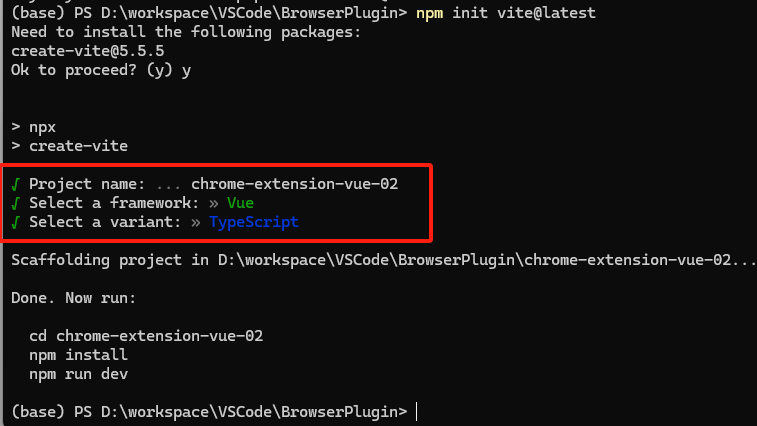
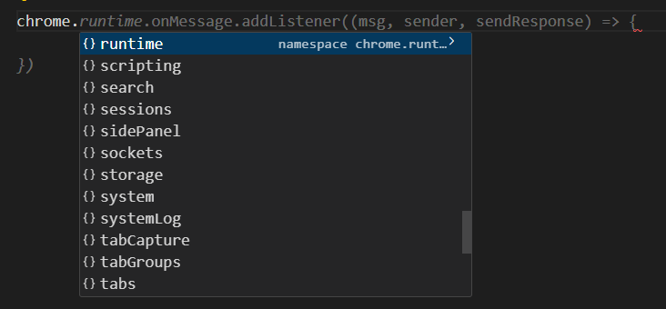
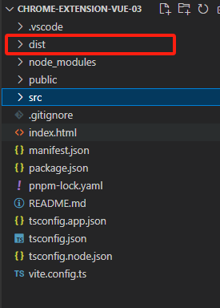
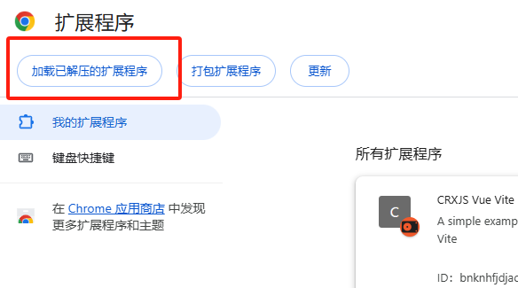

[toc]

# CRXJS+Vite+Vue+Ts创建扩展项目

## 1、创建vite项目

找到工作目录，打开`cmd`命令窗口，输入以下命令

```bash
pnpm init vite@latest
```

输入项目名称，选择`Vue`和`TypeScript`。



## 2、创建Manifest.json

进入到项目文件夹中，创建`manifest.json`文件，可以简单配置一些内容：

```json
{
    "manifest_version": 3,
    "name": "CRXJS Vue Vite Example",
    "description": "A simple example of using CRXJS with Vue and Vite",
    "version": "1.0.0",
    "action": {
      "default_popup": "index.html"
    },
    "content_scripts": [
        {
            "matches": ["https://www.baidu.com/**"],
            "js": ["src/content/content.ts"]
        }
    ],
    "background": {
        "service_worker": "src/background/background.ts"
    }
}
```

当进入到`www.baidu.com`页面时，`src/content/content.ts`文件会执行（文件和目录自行创建）。

`src/background/background.ts`则会一直在后台执行。

## 3、配置环境

进入到项目文件夹中，安装依赖:

```bash
pnpm i
```

### 3.1 CRXJS配置

安装`crxjs`：

```bash
pnpm i @crxjs/vite-plugin@beta -D
```

找到项目中的`vite.config.ts`文件，配置以下内容：

```ts
import { defineConfig } from 'vite'
import vue from '@vitejs/plugin-vue'
import { crx } from '@crxjs/vite-plugin'
import manifest from './manifest.json' assert { type: 'json' } // Node >=17

// https://vitejs.dev/config/
export default defineConfig({
  plugins: [
    vue(),
    crx({ manifest }),
  ],
})
```

### 3.2 ElementPlus配置

安装`ElementPlus`:

```bash
pnpm i element-plus
```

找到`src`目录下的`main.ts`文件配置以下内容：

```ts
import { createApp } from 'vue'
import './style.css'
import App from './App.vue'
import ElementPlus from 'element-plus'
import 'element-plus/dist/index.css'

createApp(App).use(ElementPlus).mount('#app')
```

### 3.3 chrome配置

安装`chrome-types`:

```bash
pnpm i chrome-types -D
```

找到`src`目录下的`vite-env.d.ts`文件，添加以下内容：

```ts
/// <reference types="chrome-types/index" />
```

这样不论是在`vue`文件中还是在`ts`文件中，使用`chrome`时都会有相应的提示：



## 4、启动项目

```bash
pnpm run dev
```

命令执行后会在项目中生成`dist`文件夹：



使用`chrome`浏览器将该文件夹加载进来：



## end、遇到的坑

### 1、chrome.storage.local未定义

在`manifest.json`中配置权限：

```json
"permissions": [
    "storage"
],
```

删除`dist`文件夹，并且在浏览器插件中移除掉该插件，重新执行

```basg
pnpm run dev
```

并将`dist`重新导入到浏览器插件中即可。

### 2、ts文件中无法使用chrome.runtime.sendMessage({ })

安装：

```bash
pnpm i @types/chrome -D
```

重新启动。